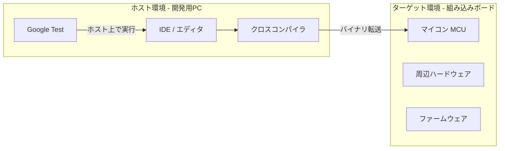
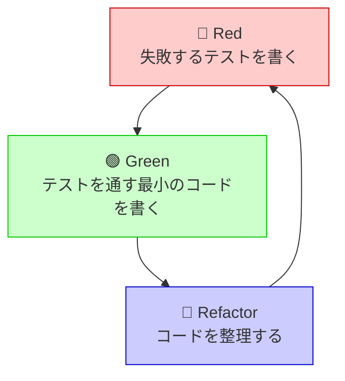
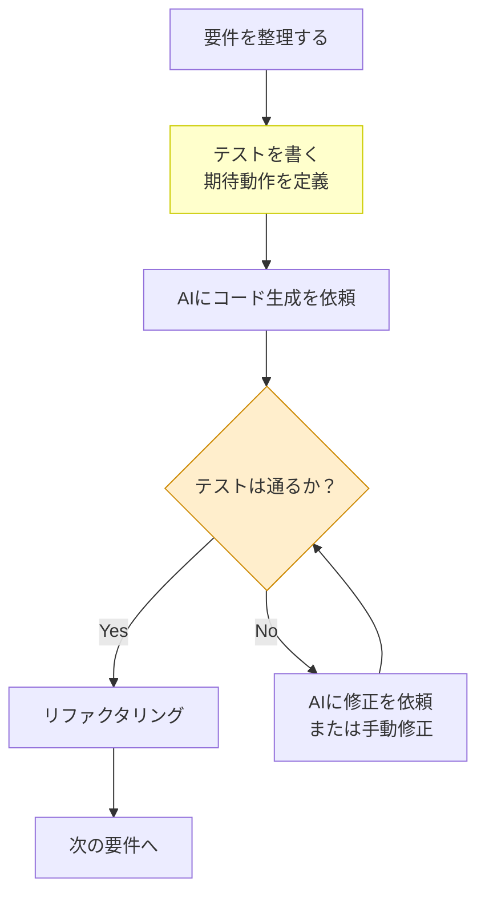
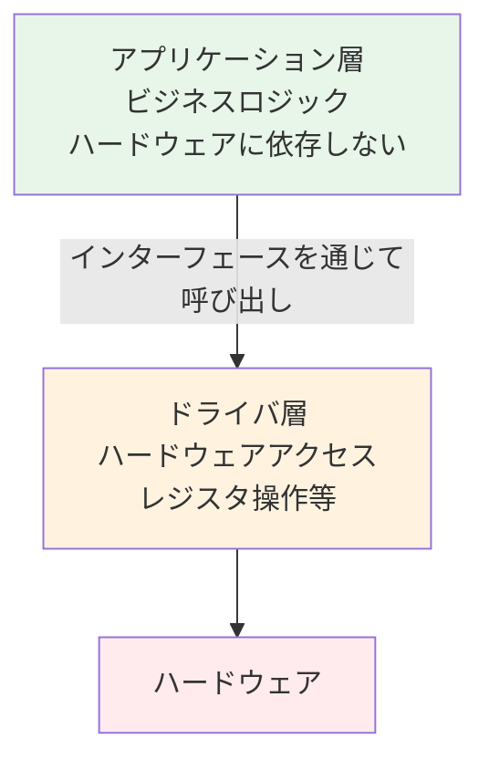
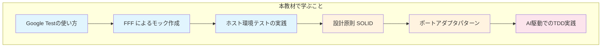

# 第1章: はじめに — なぜ組み込みCにテスト駆動開発が必要か

## 1.1 組み込み開発の課題

組み込みソフトウェア開発には、PC向けアプリケーション開発とは異なる特有の課題があります。

### ターゲットとホストの違い

組み込みシステムでは、**ターゲット**（実際のハードウェア）と**ホスト**（開発用PC）という2つの環境が存在します。

従来の組み込み開発では、コードを書いてからターゲットにダウンロードし、実機で動作確認するまでのサイクルが長くなりがちです。この待ち時間が開発効率を大きく低下させます。

### ホスト環境テストの利点

ホスト環境（開発用PC上）でテストを実行すると、以下の利点が得られます。

| 比較項目 | ターゲット環境テスト | ホスト環境テスト |
|---------|-------------------|----------------|
| 実行速度 | 遅い（転送・起動に時間がかかる） | 速い（即座に実行可能） |
| 再現性 | ハードウェア状態に依存 | 毎回同じ条件で実行可能 |
| 自動化 | 難しい | CI/CDに組み込みやすい |
| フィードバック | 数分〜数十分 | 数秒 |

## 1.2 テスト駆動開発（TDD）とは

テスト駆動開発（TDD: Test-Driven Development）は、**テストを先に書き、そのテストを通すコードを後から書く**という開発手法です。

### TDDの3つのステップ（Red-Green-Refactor）

1. **Red（赤）**: まず失敗するテストを書く。このテストは「こう動いてほしい」という仕様を表現する
2. **Green（緑）**: テストを通す最小限のコードを書く。完璧でなくてよい
3. **Refactor（リファクタリング）**: テストが通る状態を保ちながら、コードを整理・改善する

この3ステップを短いサイクルで繰り返すことで、常にテストに裏付けられたコードが書かれます。

## 1.3 AI駆動開発とTDDの関係

近年、GitHub CopilotなどのAIツールがコード生成を支援しています。しかし、AIが生成したコードが正しいかどうかは、人間が検証しなければなりません。

### AIがコードを生成する時代にTDDが必要な理由

**テストがなければ、AIの出力を検証する手段がありません。** TDDは、AI駆動開発においてさらに重要性を増しています。

| 観点 | テストなし | テストあり（TDD） |
|------|----------|-----------------|
| AIの出力検証 | 目視確認のみ | 自動テストで検証 |
| 仕様の明確化 | 曖昧なまま | テストが仕様書になる |
| リグレッション防止 | 気づかないうちに壊れる | テストが即座に検知 |
| AI への指示の質 | 漠然とした依頼 | テストで具体的に定義 |

### 人間が注意すべきポイント

AIを活用する際、人間は以下に注意を払う必要があります。

1. **テストの設計は人間が行う** — AIに「何をテストするか」を決めさせない
2. **境界条件を意識する** — AIは典型的なケースは得意だが、境界条件を見落とすことがある
3. **アーキテクチャの判断は人間が行う** — 依存関係の方向やモジュール分割はAIに丸投げしない
4. **生成コードのレビュー** — AIの出力を鵜呑みにせず、テストで検証する

## 1.4 アプリケーション層とドライバ層の分離

組み込みソフトウェアでは、**アプリケーション層（APP）** と **ドライバ層（DRV）** を分離することが一般的です。

- **アプリケーション層**: ビジネスロジックを担当する。例えば「2つの値を加算する」「温度が閾値を超えたらアラームを鳴らす」などの処理
- **ドライバ層**: ハードウェアへのアクセスを担当する。例えば「GPIOレジスタを操作する」「ADCの値を読み取る」などの処理

この分離が重要な理由は、**テスト時にドライバ層をフェイク（偽物）に差し替えることで、ハードウェアなしでもアプリケーション層のロジックをテストできる**からです。この考え方は、第5章で学ぶ「依存性逆転の原則（DIP）」や第6章の「ポートアダプタパターン」の基礎となります。

## 1.5 本教材の目標

本教材を通じて、以下のスキルを身につけることを目指します。

1. **Google Test** を使った組み込みCコードのホスト環境テスト
2. **FFF（Fake Function Framework）** を使ったフェイク関数の作成（テスト用の偽物の関数を生成）
3. **SOLID原則**、特に**依存性逆転の原則（DIP）** の理解と適用
4. **ポートアダプタパターン**によるハードウェア依存の分離
5. **AI駆動開発**でTDDを活用するための考え方と実践
