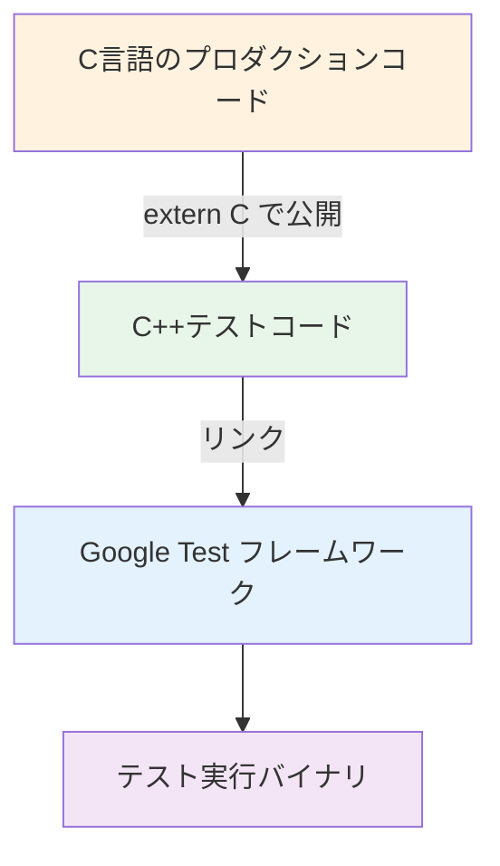
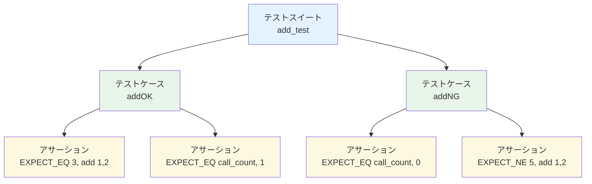
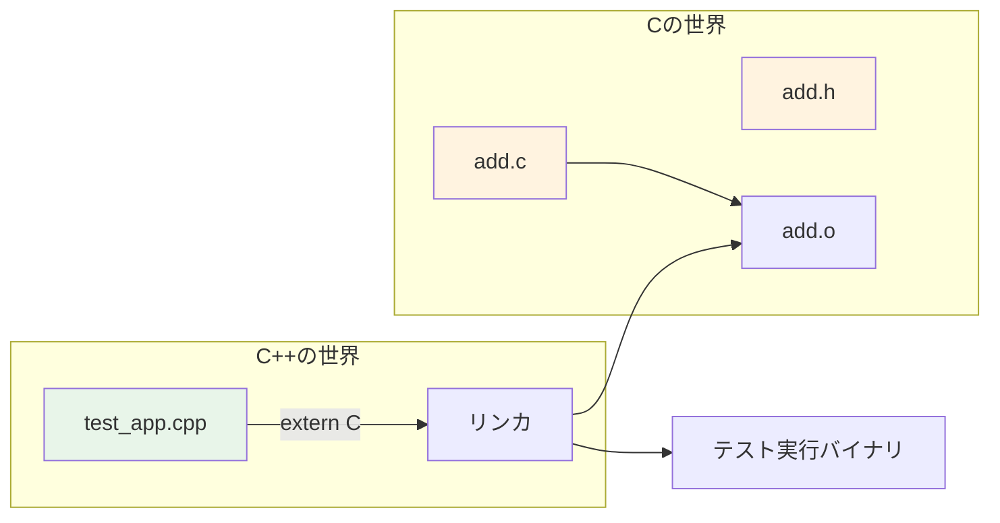
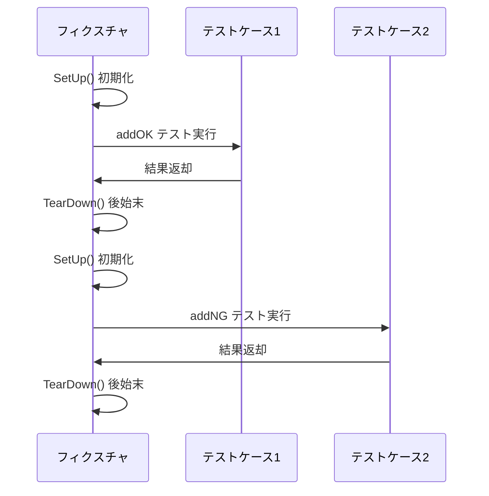
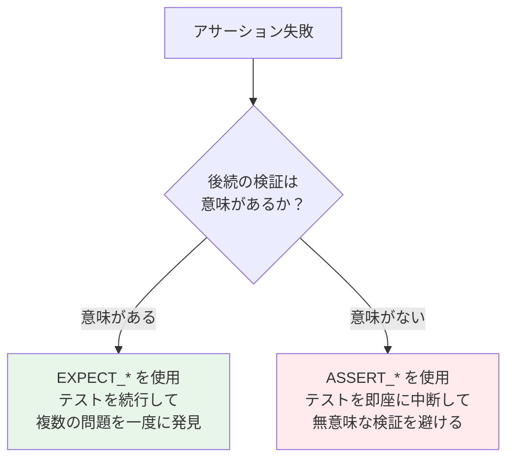
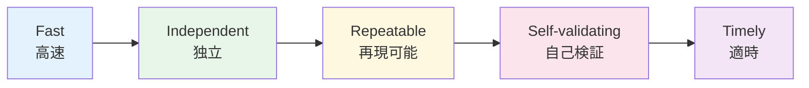

# 第3章: Google Testの基本 — テストの書き方を学ぶ

## 3.1 Google Testとは

Google Test（gtest）は、Googleが開発したC++用テストフレームワークです。組み込みCのテストでは、テストコードをC++で書き、テスト対象のCコードをリンクして使います。

### なぜC++のフレームワークでCをテストするのか



C言語にはテストフレームワークも存在しますが（CUnit、Unity等）、Google Testを使う理由は以下の通りです。

| 特徴 | Google Test | CUnit/Unity |
|------|------------|-------------|
| モック機能 | 豊富（GMock, FFF連携） | 限定的 |
| テスト自動検出 | あり（マクロで自動登録） | 手動登録が必要 |
| IDE連携 | 優れている | 限定的 |
| CI/CD連携 | CTest/CDashと統合 | 追加設定が必要 |
| 情報量 | 多い（ドキュメント・コミュニティ） | 少なめ |

## 3.2 テストの構造

Google Testのテストは、以下の3つの要素で構成されます。

### テストケース、テストスイート、アサーション



- **テストスイート**: 関連するテストケースをまとめるグループ（例: `add_test`）
- **テストケース**: 個々のテスト項目（例: `addOK`, `addNG`）
- **アサーション**: テスト内での検証（例: `EXPECT_EQ(3, add(1,2))`）

## 3.3 基本的なテストの書き方

### 最もシンプルなテスト（TEST マクロ）

```cpp
#include "gtest/gtest.h"

extern "C" {
#include "add.h"
}

TEST(AddTest, PositiveNumbers) {
    EXPECT_EQ(3, add(1, 2));
}

TEST(AddTest, NegativeNumbers) {
    EXPECT_EQ(-3, add(-1, -2));
}
```

**`extern "C"`** は、C++コンパイラに「この中のヘッダはC言語の規約に従う」と伝えるための宣言です。これがないと、C++の名前マングリングにより、Cの関数がリンクできません。

### `extern "C"` の仕組み



## 3.4 フィクスチャを使ったテスト（TEST_F マクロ）

複数のテストケースで共通の初期化処理がある場合、**フィクスチャ**を使います。

### フィクスチャの実行フロー



**重要**: `SetUp()` と `TearDown()` は**各テストケースの前後に毎回実行**されます。テスト間の状態が互いに影響しないことが保証されます。

### 本プロジェクトでの実例

```cpp
// test_app.cpp
#include "gtest/gtest.h"
#include "fff.h"
DEFINE_FFF_GLOBALS;

extern "C" {
#include "../src/APP/INC/add.h"
#include "../src/DRV/INC/sub.h"
}

// doubleForFake をフェイク関数として定義
FAKE_VOID_FUNC(doubleForFake, int *);

class add_test : public ::testing::Test {
protected:
    virtual void SetUp() {
        // 各テストの前にフェイク関数の呼び出し回数をリセット
        doubleForFake_fake.call_count = 0;
    }
    virtual void TearDown() {
        // 後始末（今回は特に処理なし）
    }
};

TEST_F(add_test, addOK) {
    EXPECT_EQ(3, add(1, 2));       // add(1,2) の結果が 3 であること
    EXPECT_EQ(doubleForFake_fake.call_count, 1); // doubleForFake が1回呼ばれたこと
}

TEST_F(add_test, addNG) {
    EXPECT_EQ(doubleForFake_fake.call_count, 0); // まだ呼ばれていないこと
    EXPECT_NE(5, add(1, 2));       // add(1,2) の結果が 5 ではないこと
}
```

## 3.5 アサーションの種類

Google Test には2種類のアサーションがあります。

| アサーション | 失敗時の動作 | 使いどころ |
|------------|-----------|----------|
| `EXPECT_*` | テストを続行する | 一般的に使用。複数の検証を1テストで行う場合 |
| `ASSERT_*` | テストを即座に中断する | 後続の検証が意味をなさない場合 |

### よく使うアサーション一覧

| マクロ | 意味 | 使用例 |
|-------|------|-------|
| `EXPECT_EQ(expected, actual)` | 等しい | `EXPECT_EQ(3, add(1,2))` |
| `EXPECT_NE(val1, val2)` | 等しくない | `EXPECT_NE(5, add(1,2))` |
| `EXPECT_TRUE(condition)` | 真である | `EXPECT_TRUE(isReady())` |
| `EXPECT_FALSE(condition)` | 偽である | `EXPECT_FALSE(hasError())` |
| `EXPECT_LT(val1, val2)` | val1 < val2 | `EXPECT_LT(0, getCount())` |
| `EXPECT_LE(val1, val2)` | val1 <= val2 | `EXPECT_LE(result, MAX)` |
| `EXPECT_GT(val1, val2)` | val1 > val2 | `EXPECT_GT(size, 0)` |
| `EXPECT_GE(val1, val2)` | val1 >= val2 | `EXPECT_GE(count, 1)` |

### EXPECT vs ASSERT の使い分け



**例**: ポインタが NULL でないことを確認してから、その中身をチェックする場合

```cpp
ASSERT_NE(nullptr, ptr);   // NULL なら後続は無意味なので ASSERT
EXPECT_EQ(42, ptr->value); // ここは ASSERT の後なので安全
```

## 3.6 テスト設計のポイント

### 良いテストの特徴

良いテストには以下の特徴があります（**F.I.R.S.T.原則**）。



| 原則 | 意味 | 実践 |
|------|------|------|
| **Fast** | テストは高速に実行できる | ホスト環境で実行、外部依存を排除 |
| **Independent** | テスト間に依存がない | SetUp/TearDown で状態をリセット |
| **Repeatable** | 何度実行しても同じ結果 | 環境に依存しないテスト設計 |
| **Self-validating** | 結果が自動的に判定される | アサーションで検証 |
| **Timely** | 実装と同時に書く | TDDではテストを先に書く |
