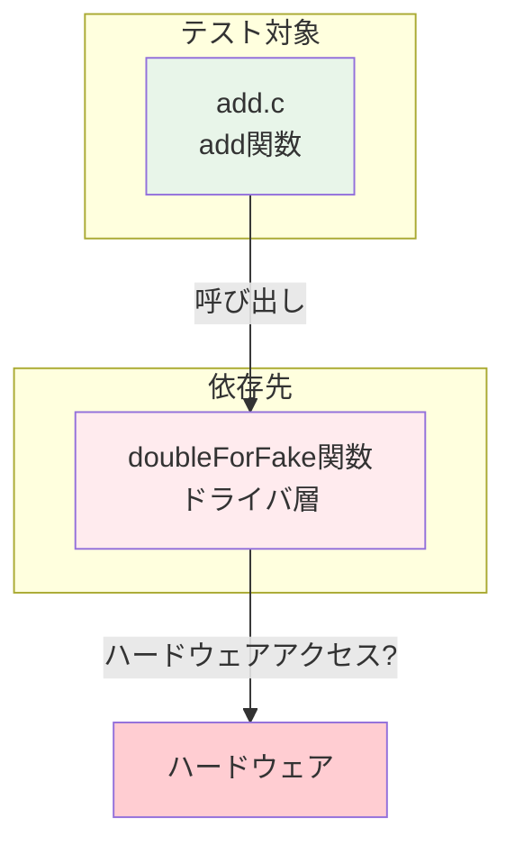
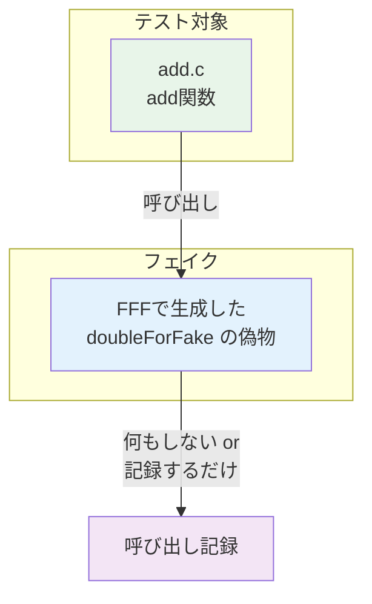
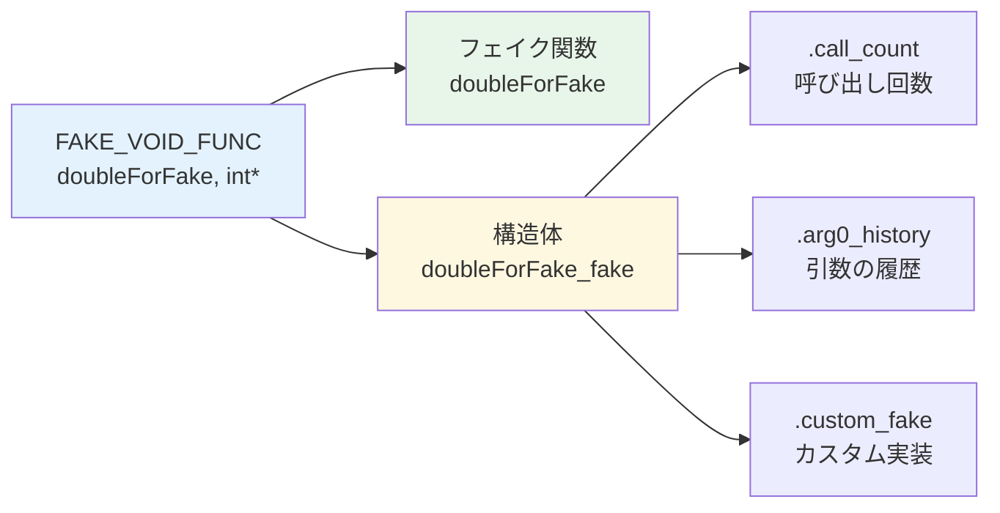
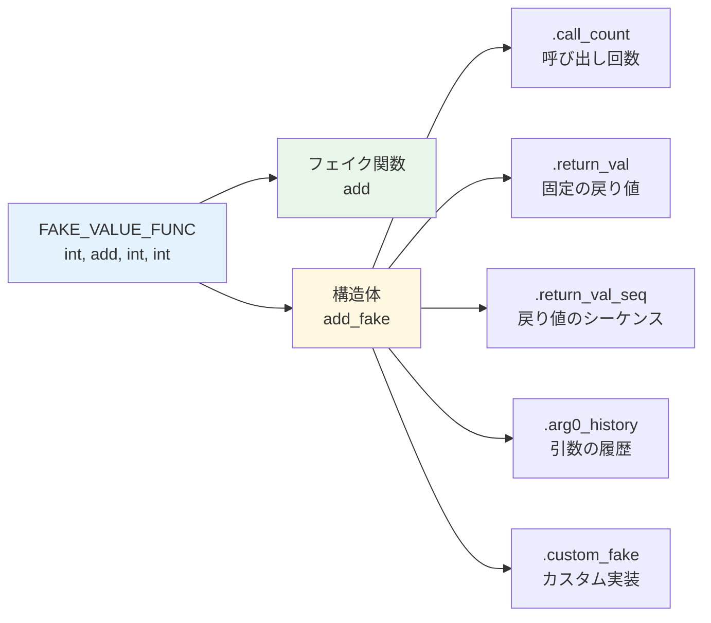
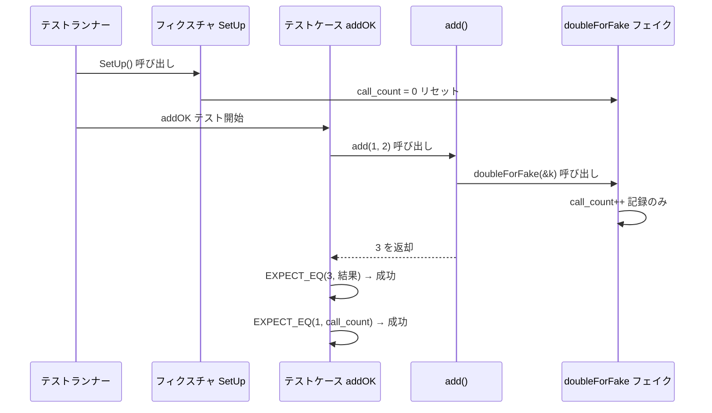
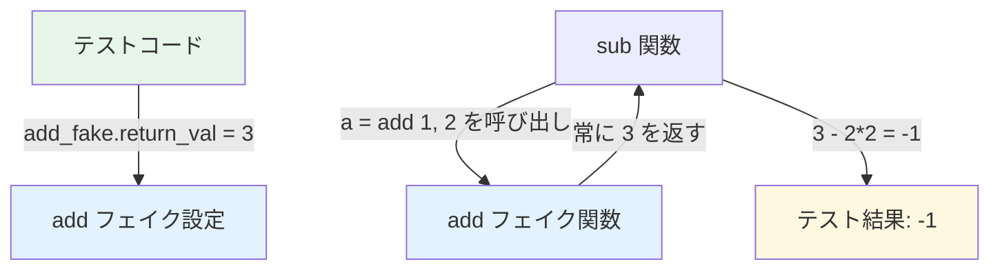
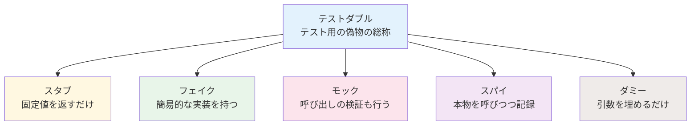

# 第4章: FFF（Fake Function Framework）— フェイク関数によるテスト

## 4.1 なぜ依存先を偽物に置き換える必要があるか

組み込みCのコードは、ハードウェアにアクセスする関数や他のモジュールの関数に依存しています。ホスト環境では、これらの依存先を**テストダブル（テスト用の偽物）**に置き換える必要があります。テストダブルの代表的な種類として「フェイク」「スタブ」「モック」がありますが、FFFは主に**フェイク関数**を生成するフレームワークです（詳細な分類は本章末尾の4.7節で説明します）。

### 依存関係の問題



`add.c` の `add()` 関数は内部で `doubleForFake()` を呼んでいます。もし `doubleForFake()` がハードウェアにアクセスする関数だったとしたら、ホスト環境ではそのまま実行できません。

### フェイクによる解決



フェイク関数は、本物の関数と同じ名前・シグネチャを持ちますが、実際のハードウェアアクセスは行いません。代わりに、呼び出し回数や引数を記録します。

## 4.2 FFF（Fake Function Framework）とは

FFF は、C/C++ 向けのフェイク関数生成フレームワークです。ヘッダファイル1つ（`fff.h`）をインクルードするだけで使えます。

### FFFの特徴

| 特徴 | 説明 |
|------|------|
| ヘッダのみ | `fff.h` をインクルードするだけで利用可能 |
| マクロベース | マクロで簡単にフェイク関数を定義 |
| 呼び出し記録 | 呼び出し回数、引数の履歴を自動記録 |
| 戻り値制御 | フェイク関数の戻り値をテストから指定可能 |
| カスタム実装 | フェイク関数にカスタムの振る舞いを設定可能 |

## 4.3 FFF の基本的な使い方

### セットアップ

```cpp
#include "gtest/gtest.h"
#include "fff.h"
DEFINE_FFF_GLOBALS;  // FFF のグローバル変数を定義（1ファイルに1回）
```

`DEFINE_FFF_GLOBALS` は、FFF が内部で使用するグローバル変数を定義するマクロです。テストファイルの先頭で一度だけ呼び出します。

### 戻り値なし（void）関数のフェイク

```cpp
// 元の関数: void doubleForFake(int *a);
FAKE_VOID_FUNC(doubleForFake, int *);
```

このマクロにより、以下の機能を持つフェイク関数が自動生成されます。



### 戻り値あり関数のフェイク

```cpp
// 元の関数: int add(int a, int b);
FAKE_VALUE_FUNC(int, add, int, int);
```

戻り値ありの場合、追加で戻り値を制御する機能が提供されます。



## 4.4 実践例：add() のテスト

### テスト対象コード（add.c）

```c
#include "add.h"
#include "sub.h"

int add(int a, int b) {
    int k = 3;
    doubleForFake(&k);  // ドライバ関数を呼んでいる
    return a + b;
}
```

`add()` は内部で `doubleForFake()` を呼んでいます。テスト時はこの関数をフェイクに置き換えます。

### テストコード（test_app.cpp）

```cpp
#include "gtest/gtest.h"
#include "fff.h"
DEFINE_FFF_GLOBALS;

extern "C" {
#include "../src/APP/INC/add.h"
#include "../src/DRV/INC/sub.h"
}

// doubleForFake をフェイクとして定義
FAKE_VOID_FUNC(doubleForFake, int *);

class add_test : public ::testing::Test {
protected:
    virtual void SetUp() {
        doubleForFake_fake.call_count = 0;  // 呼び出し回数をリセット
    }
    virtual void TearDown() {}
};

TEST_F(add_test, addOK) {
    EXPECT_EQ(3, add(1, 2));                    // 計算結果の検証
    EXPECT_EQ(doubleForFake_fake.call_count, 1); // 関数が1回呼ばれたか
}

TEST_F(add_test, addNG) {
    EXPECT_EQ(doubleForFake_fake.call_count, 0); // まだ呼ばれていない
    EXPECT_NE(5, add(1, 2));                     // 5ではないことの検証
}
```

### テスト実行の流れ



## 4.5 実践例：sub() のテスト

### テスト対象コード（drv1.c）

```c
#include "sub.h"
#include "add.h"

int sub(int a, int b) {
    a = add(a, b);     // add() に依存している
    return a - 2 * b;
}
```

`sub()` は `add()` を呼んでいます。`sub()` を単独でテストするには、`add()` をフェイクに置き換えます。

### テストコード（test_drv.cpp）

```cpp
extern "C" {
#include "../src/APP/INC/add.h"
#include "../src/DRV/INC/sub.h"
}

// add を戻り値ありのフェイクとして定義
FAKE_VALUE_FUNC(int, add, int, int);

class sub_test : public ::testing::Test {
protected:
    virtual void SetUp() {
        add_fake.call_count = 0;
    }
    virtual void TearDown() {}
};

TEST_F(sub_test, subOK) {
    add_fake.return_val = 3;           // add() の戻り値を 3 に固定
    EXPECT_EQ(-1, sub(1, 2));          // 3 - 2*2 = -1
    EXPECT_EQ(add_fake.call_count, 1); // add() が1回呼ばれたか
}
```

### 戻り値制御の仕組み



**ポイント**: `add_fake.return_val = 3` を設定することで、`add()` が何を引数に呼ばれても常に `3` を返します。これにより、`sub()` のロジックだけを独立してテストできます。

## 4.6 FFF の高度な機能

### 戻り値シーケンス

呼び出しごとに異なる戻り値を返したい場合に使います。

```cpp
int return_values[] = {1, 2, 3};
SET_RETURN_SEQ(add, return_values, 3);

// 1回目の呼び出し: 1 を返す
// 2回目の呼び出し: 2 を返す
// 3回目の呼び出し: 3 を返す
```

### カスタムフェイク

フェイク関数に独自の振る舞いを実装できます。

```cpp
int my_custom_add(int a, int b) {
    return a * b;  // テスト用に掛け算にする
}

add_fake.custom_fake = my_custom_add;
```

### 引数の履歴

```cpp
add(10, 20);
add(30, 40);

EXPECT_EQ(10, add_fake.arg0_history[0]);  // 1回目の第1引数
EXPECT_EQ(20, add_fake.arg1_history[0]);  // 1回目の第2引数
EXPECT_EQ(30, add_fake.arg0_history[1]);  // 2回目の第1引数
```

## 4.7 モック・フェイク・スタブの違い

テストで使う「偽物」には、いくつかの種類があります。



| 種類 | 説明 | FFFでの対応 |
|------|------|-----------|
| **スタブ** | 固定値を返す | `return_val` の設定 |
| **フェイク** | 簡易実装を持つ | `custom_fake` で実装 |
| **モック** | 呼び出しを検証する | `call_count`, `arg_history` で検証 |
| **スパイ** | 本物を呼びつつ記録 | `custom_fake` で本物を呼ぶ |
| **ダミー** | 引数を満たすためだけに存在 | 引数なしのフェイク |

FFF は主にフェイク関数の生成に特化していますが、`call_count` や `arg_history` によるモック的な検証、`custom_fake` によるスパイ的な使い方も可能です。
