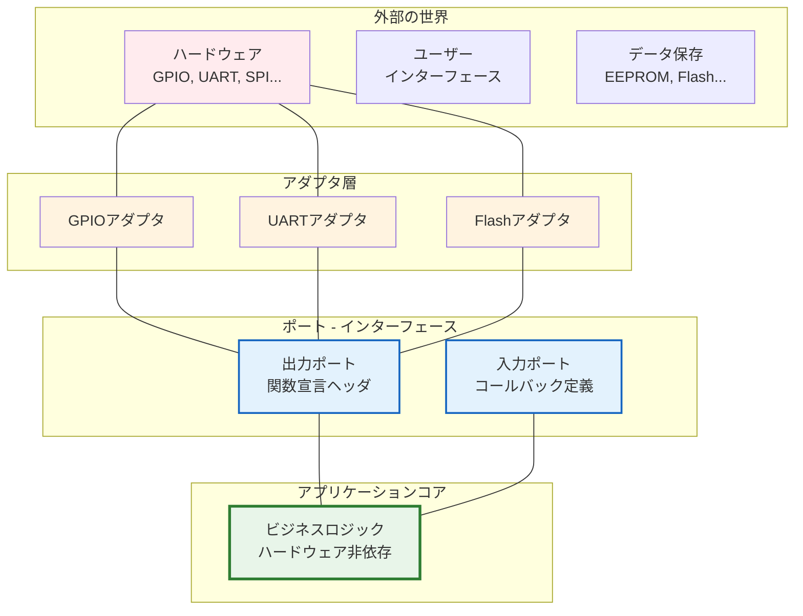
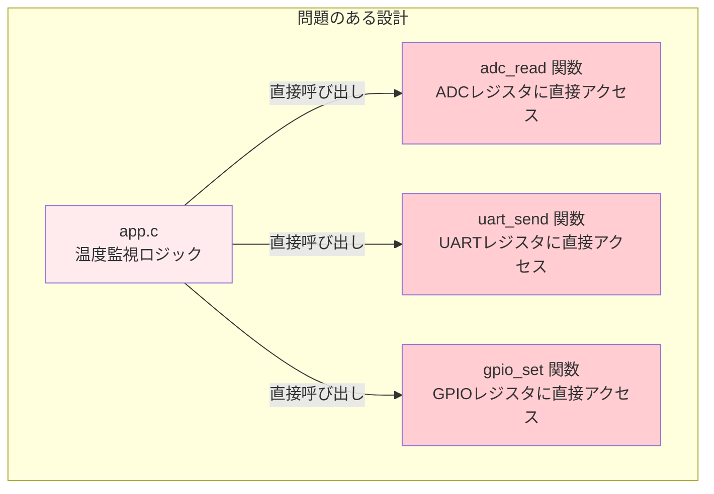
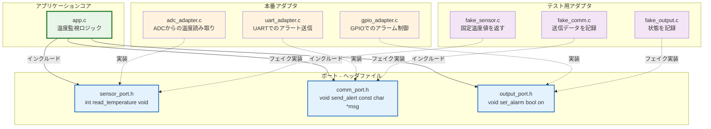
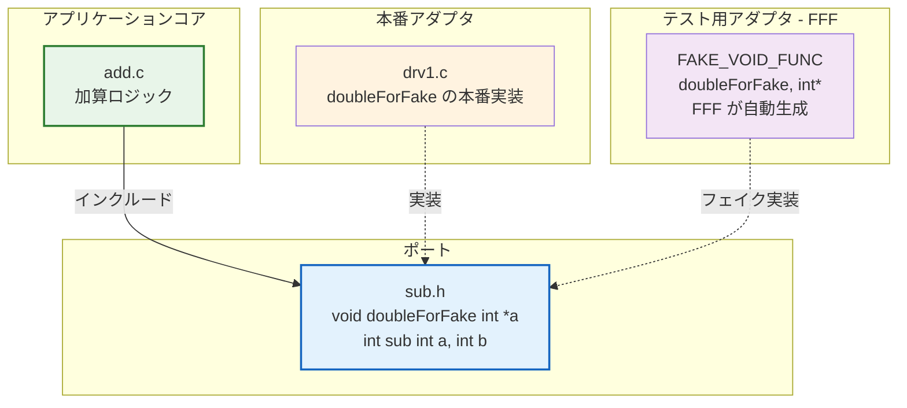
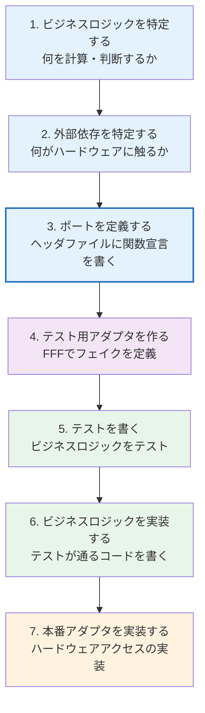
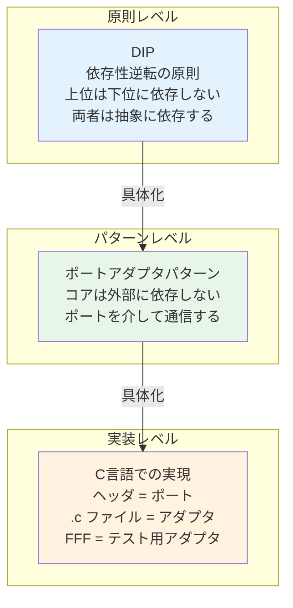
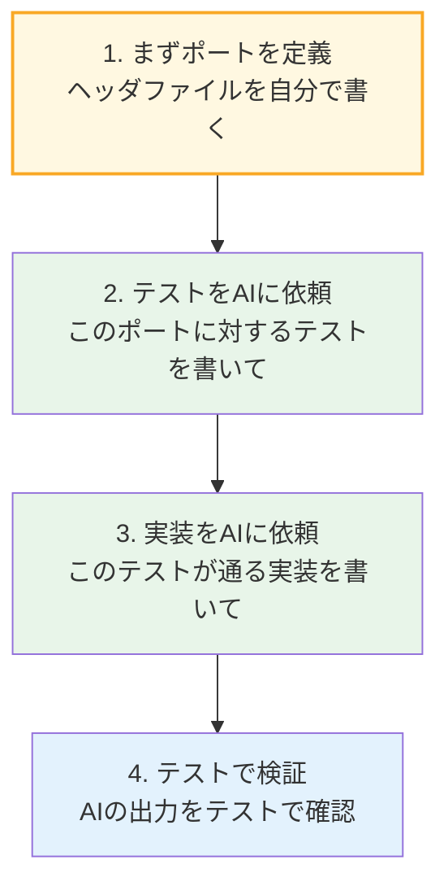

# 第6章: ポートアダプタパターン — ハードウェア依存を分離する

## 6.1 ポートアダプタパターンとは

第5章で学んだ依存性逆転の原則（DIP）を、アーキテクチャレベルに拡張したのが**ポートアダプタパターン**（別名: ヘキサゴナルアーキテクチャ）です。DIPが「依存の方向を逆転させる」という原則だったのに対し、ポートアダプタパターンは「アプリケーションの核心ロジックをポート（インターフェース）で囲み、外部をアダプタ（実装）で接続する」という具体的な構造を提供します。

### 基本構造



### 用語の定義

| 用語 | 説明 | C言語での実現 |
|------|------|-------------|
| **ポート** | アプリケーションコアが外部と通信するためのインターフェース | 関数宣言を含むヘッダファイル（`.h`） |
| **アダプタ** | ポートの具体的な実装 | そのヘッダを実装する `.c` ファイル |
| **アプリケーションコア** | ビジネスロジック本体。外部に依存しない | ポートのヘッダのみをインクルード |

## 6.2 組み込みCでの適用

### 従来の設計（ポートアダプタなし）



この設計では `app.c` がハードウェアに直接依存しており、ホスト環境ではテストできません。

### ポートアダプタ適用後



## 6.3 本プロジェクトでのポートアダプタ

本プロジェクトの構造を、ポートアダプタの視点で見直してみましょう。



| 要素 | ポートアダプタでの役割 | 本プロジェクトでの対応 |
|------|---------------------|---------------------|
| アプリケーションコア | ビジネスロジック | `add.c`（加算処理） |
| ポート | インターフェース定義 | `sub.h`（関数宣言） |
| 本番アダプタ | 実際のハードウェア実装 | `drv1.c`（ドライバ実装） |
| テスト用アダプタ | テスト用のフェイク実装 | FFFマクロによるフェイク |

## 6.4 ポートアダプタ設計のステップ

新しい機能を追加する際の、ポートアダプタを意識した設計手順は以下の通りです。



**ポイント**: 本番アダプタ（ハードウェア実装）は**最後に**書きます。ビジネスロジックのテストは、ハードウェアなしでも完了できます。

## 6.5 DIPとポートアダプタの関係

DIP（依存性逆転の原則）とポートアダプタパターンは、同じ問題を異なる抽象度で表現しています。



| レベル | 概念 | 説明 |
|--------|------|------|
| 原則 | DIP | 依存の方向を逆転させる。上位が下位に依存しない |
| パターン | ポートアダプタ | DIPを構造化したアーキテクチャパターン |
| 実装 | ヘッダ + FFF | C言語での具体的な実現方法 |

## 6.6 AI駆動開発でのポートアダプタ

AIにコード生成を依頼する際、ポートアダプタを意識することで品質が向上します。

### AIへの良い依頼方法



**人間が担うべき責任**:
1. **ポート（インターフェース）の定義** — これはアーキテクチャの判断であり、人間が行う
2. **テスト設計の方針決定** — 何をテストするかは人間が決める
3. **生成コードのレビュー** — AIの出力がポートの契約に従っているか確認する

**AIに委ねてよいこと**:
1. テストコードのボイラープレート（定型文）
2. アダプタの実装（ヘッダの関数宣言に合わせた `.c` ファイル）
3. FFFのフェイク定義

```
[AIへの依頼例]
以下のヘッダファイル（ポート）に対して：
- FFFを使ったフェイクの定義
- Google Testのフィクスチャ
- 正常系・異常系のテストケース
を作成してください。

ヘッダファイル:
// sensor_port.h
int read_temperature(void);
bool is_sensor_ready(void);
```
