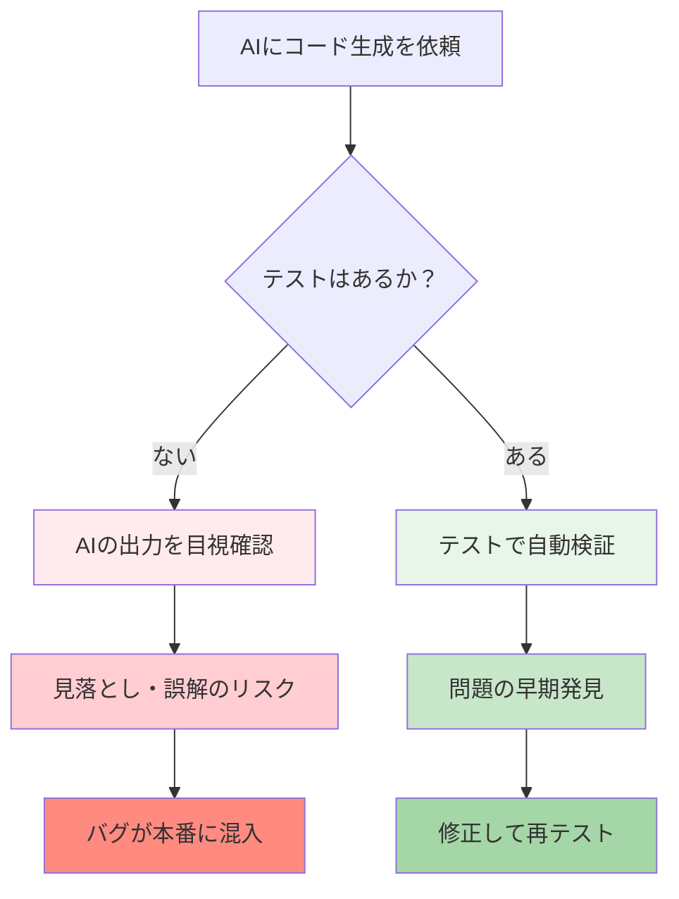
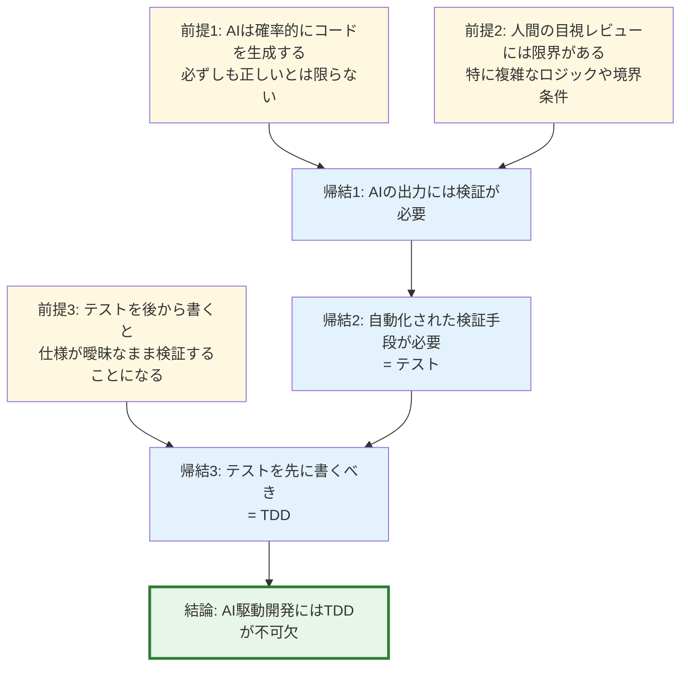
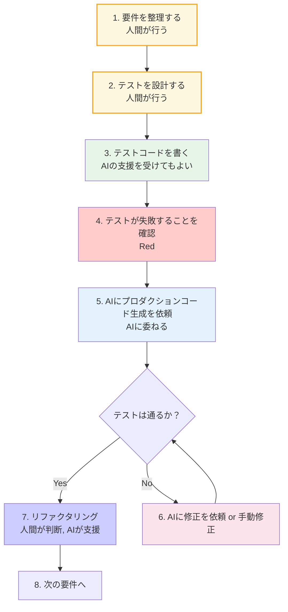
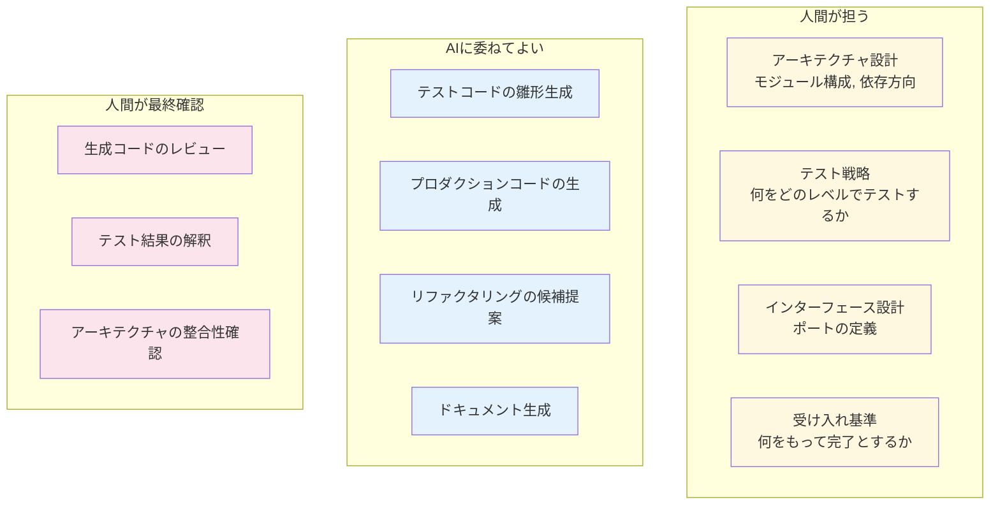
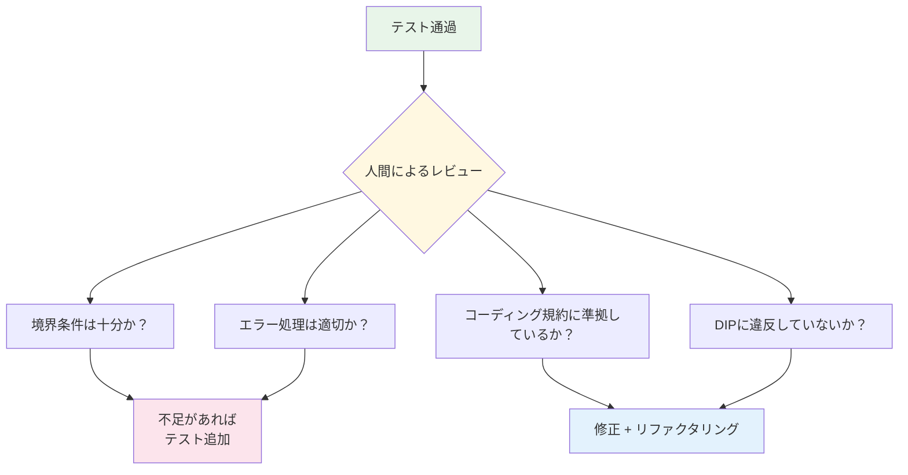
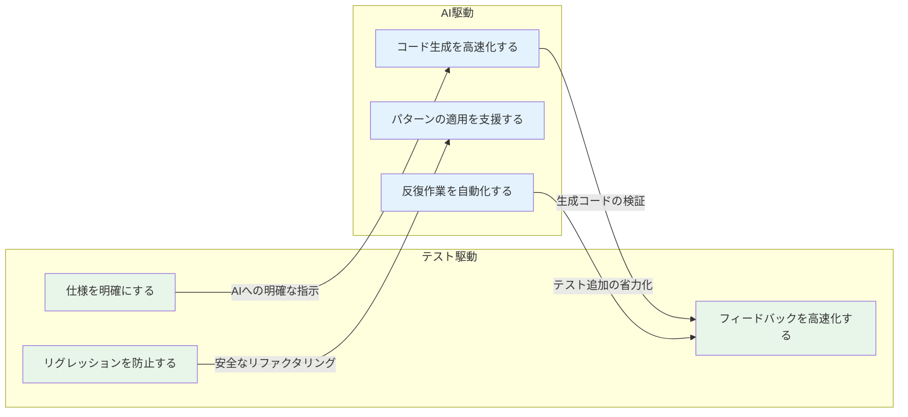
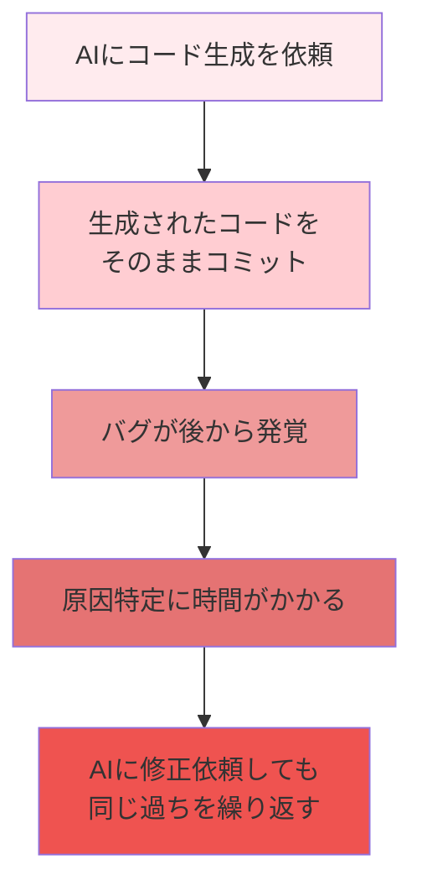
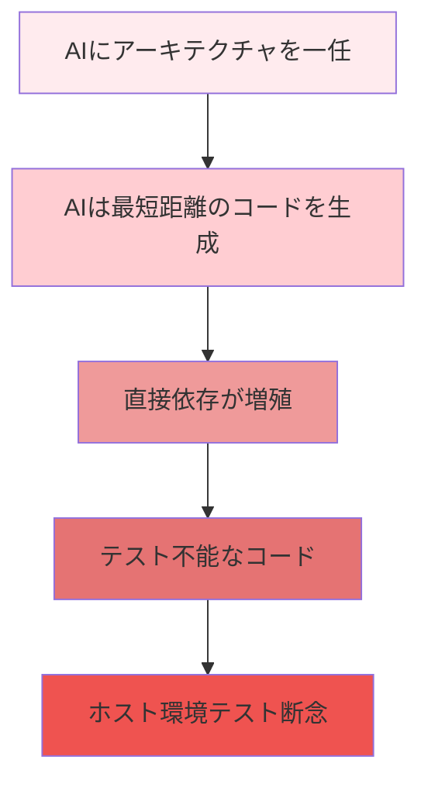
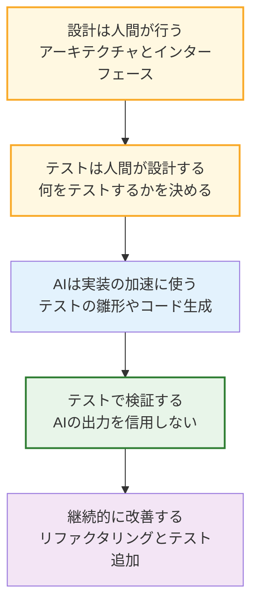

# 第7章: AI駆動開発とテスト駆動開発の融合

## 7.1 AI駆動開発の現在地

GitHub Copilot、ChatGPT、Claude などの AI ツールは、コード生成を劇的に高速化しました。しかし、AI が生成したコードの品質を保証するのは依然として**人間の責任**です。

### AI駆動開発の落とし穴



## 7.2 なぜTDDがAI駆動開発に不可欠か

### 論理的根拠

以下の論理でTDDの必要性を導きます。



### AI駆動 × TDDのワークフロー



## 7.3 人間が担うべき判断

AI駆動開発において、人間が注意すべきポイントを体系的に整理します。

### 判断の階層



### チェックリスト: AI生成コードのレビュー

| チェック項目 | 確認内容 | 具体例 |
|------------|---------|--------|
| 境界条件 | 入力の最小・最大値でのテストがあるか | `INT_MAX`, `INT_MIN`, `NULL`, 空配列 |
| エラー処理 | 異常系のハンドリングがあるか | メモリ不足、タイムアウト、不正入力 |
| 副作用 | グローバル変数の意図しない変更がないか | 静的変数の初期化漏れ |
| メモリ安全 | バッファオーバーフロー、未初期化アクセスがないか | 配列範囲チェック |
| 依存方向 | 上位が下位に依存していないか | DIPに違反していないか |
| ホスト/ターゲット差異 | 型サイズ、エンディアンの仮定はないか | `int` のサイズに依存するコード |

## 7.4 実践: TDD × AI のステップバイステップ

温度センサーの閾値判定機能を、TDD × AI で開発する手順を示します。

### ステップ1: 要件の整理（人間）

```
要件: 温度が閾値を超えたらアラームを鳴らす
- 温度は整数値（℃）
- 閾値はコンパイル時定数（50℃）
- アラームは ON/OFF の2状態
```

### ステップ2: ポートの定義（人間）

```c
// sensor_port.h — ポート定義（人間が書く）
#ifndef SENSOR_PORT_H
#define SENSOR_PORT_H

#include <stdbool.h>

int read_temperature(void);
void set_alarm(bool on);

#endif
```

### ステップ3: テストの設計と作成（人間 + AI支援）

```cpp
// test_temp_monitor.cpp
#include "gtest/gtest.h"
#include "fff.h"
DEFINE_FFF_GLOBALS;

extern "C" {
#include "sensor_port.h"
#include "temp_monitor.h"
}

FAKE_VALUE_FUNC(int, read_temperature);
FAKE_VOID_FUNC(set_alarm, bool);

class TempMonitorTest : public ::testing::Test {
protected:
    void SetUp() override {
        read_temperature_fake.call_count = 0;
        set_alarm_fake.call_count = 0;
    }
};

// 閾値以下 → アラームOFF
TEST_F(TempMonitorTest, BelowThreshold_AlarmOff) {
    read_temperature_fake.return_val = 49;
    check_temperature();
    EXPECT_EQ(set_alarm_fake.arg0_history[0], false);
}

// 閾値超え → アラームON
TEST_F(TempMonitorTest, AboveThreshold_AlarmOn) {
    read_temperature_fake.return_val = 51;
    check_temperature();
    EXPECT_EQ(set_alarm_fake.arg0_history[0], true);
}

// ちょうど閾値 → アラームOFF（境界条件）
TEST_F(TempMonitorTest, ExactThreshold_AlarmOff) {
    read_temperature_fake.return_val = 50;
    check_temperature();
    EXPECT_EQ(set_alarm_fake.arg0_history[0], false);
}
```

### ステップ4: テストが失敗することを確認（Red）

この時点では `temp_monitor.h` と `check_temperature()` の実装がないため、コンパイルエラーになります。これが「Red」の状態です。

### ステップ5: AIにコード生成を依頼

```
[AIへの依頼]
以下のテストが通るように、temp_monitor.h と temp_monitor.c を作成してください。
- sensor_port.h のインターフェースを使用すること
- 閾値は #define TEMP_THRESHOLD 50 とすること
[テストコードを添付]
```

### ステップ6: AIが生成したコード（例）

```c
// temp_monitor.h
#ifndef TEMP_MONITOR_H
#define TEMP_MONITOR_H

#define TEMP_THRESHOLD 50

void check_temperature(void);

#endif

// temp_monitor.c
#include "temp_monitor.h"
#include "sensor_port.h"

void check_temperature(void) {
    int temp = read_temperature();
    if (temp > TEMP_THRESHOLD) {
        set_alarm(true);
    } else {
        set_alarm(false);
    }
}
```

### ステップ7: テストで検証（Green）

テストを実行し、すべて通ることを確認します。

### ステップ8: レビューと改善



## 7.5 テスト駆動とAI駆動の相乗効果



| テスト駆動の強み | AI駆動の強み | 融合による効果 |
|----------------|-------------|--------------|
| 仕様の明確化 | コードの高速生成 | 明確な仕様 → 正確な生成 |
| 即座のフィードバック | パターン適用の支援 | 生成 → 検証 → 修正の高速ループ |
| リグレッション防止 | 反復作業の自動化 | 安全かつ高速な開発 |

## 7.6 アンチパターン: やってはいけないこと

### 1. テストなしでAI生成コードを採用する



### 2. AIにテスト設計を丸投げする

AIにテスト設計を任せると、以下の問題が起こります。

- **網羅性の欠如**: AIは「よくあるケース」は得意だが、ドメイン固有の境界条件を見落とす
- **仕様の誤解**: AIは仕様を推測するため、意図と異なるテストを生成する
- **テストの形骸化**: テストが通るようにテストを書くだけで、実質的な検証にならない

### 3. DIPを無視してAIにアーキテクチャを決めさせる



## 7.7 まとめ: AI時代の組み込み開発者の心得



1. **設計は人間が行う**: アーキテクチャ（モジュール構成、依存方向）は人間が決める
2. **テストは人間が設計する**: テストで「何を検証するか」は人間が決める
3. **AIは実装を加速する**: テストコードの雛形生成、プロダクションコードの生成に活用
4. **テストで検証する**: AIの出力は必ずテストで検証する
5. **継続的に改善する**: テスト通過後もリファクタリングとテスト追加を行う
