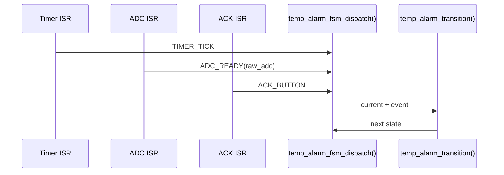

# 第9章: ISR設計と副作用の分離

第8章で作った状態機械を、実際の割り込み入口へどう接続するかを扱う章です。温度アラームを題材に、ISRを短く保ちつつ状態機械へイベントを渡す具体例を、Before/After、SOLID、DIP、純粋関数と副作用のテスト分担まで含めてまとめます。

## 9.1 ねらい

- ISRで何をやるべきかを具体例で説明できるようにする
- タイマ、ADC完了、ボタン割り込みの役割を分離する
- ISR由来のイベントもホスト環境でテストできるようにする

## 9.2 Before: ISRの中で全部やる

bad_isr.c では、ISR の中で ADC 読み取り、判定、GPIO 制御、ログ出力、待ち処理まで行います。

```c
void TIM2_IRQHandler(void) {
    uint16_t raw = hal_adc_read(TEMP_ADC_CHANNEL);
    int16_t temp = temperature_convert(raw);

    if (temp > TEMP_ALARM_THRESHOLD_X10) {
        hal_gpio_write(ALARM_LED_PIN, 1);
        uart_printf("alarm\n");
    }

    while (!adc_conversion_done()) {}
}
```

問題点:

- ISR が長くなり応答性を落とす
- ロジックと副作用が混在し、ホストテストしにくい
- 割り込み入口が HAL や UART の具体実装へ直接依存する

## 9.3 ISRごとの役割

| ISR | やること | 発行イベント |
|-----|----------|--------------|
| タイマ割り込み | 次のサンプリング要求を上げる | TIMER_TICK |
| ADC完了割り込み | 取得済みADC値を状態機械へ渡す | ADC_READY |
| ACKボタン割り込み | ユーザ確認入力を通知する | ACK_BUTTON |

## 9.4 割り込みから状態機械への流れ



## 9.5 ISRの実装例

```c
void temp_alarm_fsm_on_timer_interrupt(temp_alarm_fsm_t *fsm) {
    const temp_alarm_event_t event = { TEMP_ALARM_EVENT_TIMER_TICK, 0 };
    temp_alarm_fsm_dispatch(fsm, &event);
}

void temp_alarm_fsm_on_adc_interrupt(temp_alarm_fsm_t *fsm, uint16_t raw_adc) {
    const temp_alarm_event_t event = { TEMP_ALARM_EVENT_ADC_READY, raw_adc };
    temp_alarm_fsm_dispatch(fsm, &event);
}

void temp_alarm_fsm_on_ack_interrupt(temp_alarm_fsm_t *fsm) {
    const temp_alarm_event_t event = { TEMP_ALARM_EVENT_ACK_BUTTON, 0 };
    temp_alarm_fsm_dispatch(fsm, &event);
}
```

## 9.6 After の意図

- ISR はイベント生成だけに責務を限定する
- ロジック判断は `temp_alarm_transition()` のような純粋関数へ渡す
- GPIO など実際の副作用は別レイヤで扱う

## 9.7 SOLID / DIP の観点

### S: 単一責任の原則

- Before: ISR が通知、判定、制御、ログまで担当
- After: ISR はイベント発行だけを担当

### D: 依存性逆転の原則

- Before: ISR が HAL と UART の具体実装に依存
- After: ISR は `temp_alarm_event_t` と `temp_alarm_fsm_dispatch()` という抽象境界に依存

### O: 開放閉鎖の原則

- 割り込み種別が増えても、対応するイベント変換関数を追加すれば拡張できる

## 9.8 ISRで避けること

- 長いループや待ち処理
- 複雑な分岐や複数責務の混在
- ログ整形や重い文字列処理
- 多数のモジュールへの直接書き込み

ISRが肥大化すると、割り込み遅延とテスト困難が同時に悪化します。イベントだけ渡して通常関数へ逃がす方が、安全で検証しやすい構造になります。

## 9.9 純粋関数と副作用のテスト分担

| 対象 | テスト観点 | 手段 |
|------|------------|------|
| `temp_alarm_fsm_on_timer_interrupt()` | 正しいイベント経由で状態が進むか | 構造体変化を検証 |
| `temp_alarm_transition()` | イベントに対する次状態が正しいか | 純粋関数テスト |
| `temp_monitor_execute()` | GPIO 書き込みなど副作用が正しいか | FFFで HAL をフェイク化 |

## 9.10 テストコード例

```cpp
TEST_F(TempAlarmFsmTest, TimerInterruptRequestsSampleWithoutChangingState) {
    startMonitoring();
    fsm.sample_requested = 0;

    temp_alarm_fsm_on_timer_interrupt(&fsm);

    EXPECT_EQ(TEMP_ALARM_STATE_MONITORING, fsm.state);
    EXPECT_EQ(1, fsm.sample_requested);
}

TEST_F(TempMonitorTest, SensorDisconnected_ReturnsError) {
    hal_adc_read_fake.return_val = 0;

    int16_t result = temp_monitor_execute();

    EXPECT_EQ(result, -9999);
    EXPECT_EQ(hal_gpio_write_fake.arg1_val, 1);
}

TEST_F(TempAlarmFsmTest, AckInterruptReturnsFromAlarmToMonitoring) {
    startMonitoring();
    temp_alarm_fsm_on_adc_interrupt(&fsm, 4000);

    temp_alarm_fsm_on_ack_interrupt(&fsm);

    EXPECT_EQ(TEMP_ALARM_STATE_MONITORING, fsm.state);
    EXPECT_EQ(0, fsm.alarm_led_on);
}
```

## 9.11 読み方のポイント

1. temp_alarm_fsm_on_timer_interrupt で周期イベントの上げ方を見る
2. temp_alarm_fsm_on_adc_interrupt でデータ付きイベントの渡し方を見る
3. test_event_fsm.cpp と test_state_transition.cpp を見比べると、ISRラッパーと純粋ロジックのテスト境界が分かる