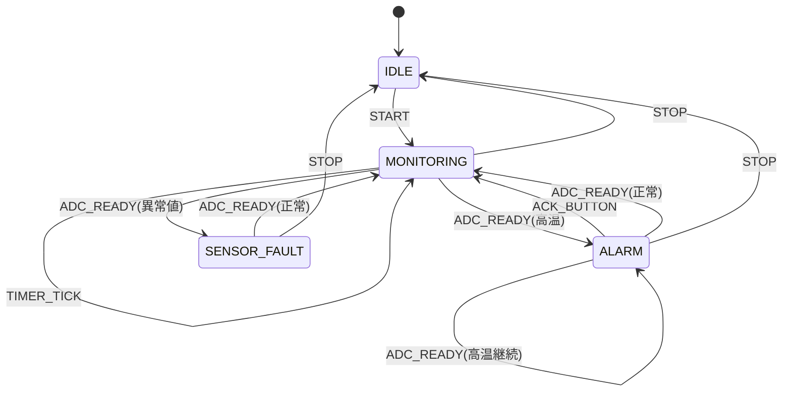

# 状態遷移の具体例

温度アラームを題材に、状態機械で仕様を表現する具体例です。ここでは Before/After、SOLID、DIP、純粋関数化、テスト戦略までまとめて扱います。

## ねらい

- 状態遷移を図と表で説明できるようにする
- 遷移ロジックと副作用を分離する
- 純粋関数として状態遷移をテストできるようにする

## Before: 状態と副作用が混在したコード

bad_state_machine.c では、ADC 読み取り、グローバル更新、状態判定、LED 制御が 1 か所に混在します。

```c
if (g_sample_due) {
    uint16_t raw = hal_adc_read(TEMP_ADC_CHANNEL);
    int16_t temp = temperature_convert(raw);
    g_last_temp_x10 = temp;

    if (raw == 0 || raw >= 4095) {
        g_alarm_state = 3;
        hal_gpio_write(ALARM_LED_PIN, 1);
    } else if (temp > TEMP_ALARM_THRESHOLD_X10) {
        g_alarm_state = 2;
        hal_gpio_write(ALARM_LED_PIN, 1);
    }
}
```

問題点:

- 状態遷移がグローバル変数で表現され、見通しが悪い
- HAL とロジックが混在し、純粋関数テストできない
- 仕様変更時に分岐が散らばる

## After: 状態遷移を純粋関数にする

After では、現在状態とイベントから次状態を返す `temp_alarm_transition()` を中心に据えます。

## 状態一覧

| 状態 | 意味 | 代表イベント |
|------|------|-------------|
| IDLE | 停止中 | START |
| MONITORING | 通常監視中 | TIMER_TICK, ADC_READY |
| ALARM | 高温検出済み | ACK_BUTTON, ADC_READY |
| SENSOR_FAULT | センサ異常 | ADC_READY, STOP |

## 状態遷移図



## 遷移の入口

```c
temp_alarm_fsm_t temp_alarm_transition(
    const temp_alarm_fsm_t *current,
    const temp_alarm_event_t *event) {
    temp_alarm_fsm_t next = *current;

    switch (event->type) {
    case TEMP_ALARM_EVENT_START:
        if (next.state == TEMP_ALARM_STATE_IDLE) {
            next.state = TEMP_ALARM_STATE_MONITORING;
            next.sample_requested = 1;
        }
        break;

    case TEMP_ALARM_EVENT_ADC_READY:
        next = temp_alarm_apply_sample(&next, event->raw_adc);
        break;

    case TEMP_ALARM_EVENT_ACK_BUTTON:
        next.state = TEMP_ALARM_STATE_MONITORING;
        next.alarm_led_on = 0;
        break;

    default:
        break;
    }

    return next;
}
```

## サンプル値で状態を決める処理

```c
static temp_alarm_fsm_t temp_alarm_apply_sample(
    const temp_alarm_fsm_t *current,
    uint16_t raw_adc) {
    temp_alarm_fsm_t next = *current;

    if (!temperature_is_valid(raw_adc)) {
        next.state = TEMP_ALARM_STATE_SENSOR_FAULT;
        next.last_temp_x10 = TEMP_ALARM_ERROR_X10;
        next.alarm_led_on = 1;
        next.sample_requested = 0;
        return next;
    }

    next.last_temp_x10 = temperature_convert(raw_adc);
    next.sample_requested = 0;

    if (temperature_is_over(next.last_temp_x10, TEMP_ALARM_THRESHOLD_X10)) {
        next.state = TEMP_ALARM_STATE_ALARM;
        next.alarm_led_on = 1;
        return next;
    }

    next.state = TEMP_ALARM_STATE_MONITORING;
    next.alarm_led_on = 0;
    return next;
}
```

## SOLID / DIP の観点

### S: 単一責任の原則

- Before: `bad_temp_alarm_task()` が読み取り、判定、状態変更、LED 制御まで担当
- After: `temp_alarm_transition()` は遷移だけ、`temp_alarm_fsm_dispatch()` は反映だけ

### D: 依存性逆転の原則

- Before: 状態ロジックが HAL やグローバル状態へ直接依存
- After: 状態ロジックは `temp_alarm_event_t` という抽象イベントに依存

### O: 開放閉鎖の原則

- 新しいイベントを追加するときは enum と switch を拡張するだけでよい

## 純粋関数化とテスト

`temp_alarm_transition()` は入力を変更せず、次状態を返します。これは状態遷移を純粋関数として扱うためです。

## テストコード例

```cpp
TEST_F(TempAlarmTransitionTest, StartEventReturnsMonitoringWithoutMutatingInput) {
    temp_alarm_event_t event = { TEMP_ALARM_EVENT_START, 0 };

    temp_alarm_fsm_t next = temp_alarm_transition(&current, &event);

    EXPECT_EQ(TEMP_ALARM_STATE_IDLE, current.state);
    EXPECT_EQ(TEMP_ALARM_STATE_MONITORING, next.state);
    EXPECT_EQ(1, next.sample_requested);
}
```

テスト観点:

- 入力状態が変化しないこと
- イベントごとの次状態が正しいこと
- LED やサンプル要求のような「副作用計画」が状態データとして返ること

## 副作用をどう扱うか

状態遷移そのものは純粋関数でテストし、実際の GPIO 書き込みなどの副作用は別レイヤで扱います。たとえば `temp_monitor_execute()` の副作用は FFF で HAL をフェイク化してテストします。

```cpp
TEST_F(TempMonitorTest, SensorDisconnected_ReturnsError) {
    hal_adc_read_fake.return_val = 0;

    int16_t result = temp_monitor_execute();

    EXPECT_EQ(result, -9999);
    EXPECT_EQ(hal_gpio_write_fake.arg1_val, 1);
}
```

## 読み方のポイント

1. temp_alarm_transition を読むと、遷移の純粋ロジックが分かる
2. temp_alarm_apply_sample を読むと、温度サンプルから状態が決まる流れが分かる
3. test_state_transition.cpp を読むと、状態遷移をホストで直接テストする方法が分かる