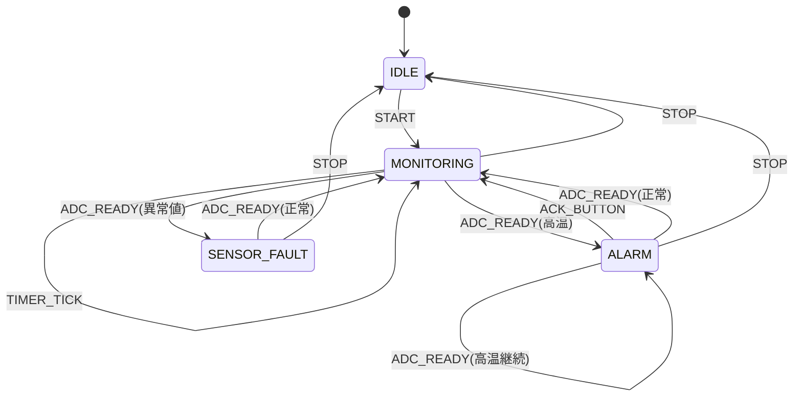

# 状態遷移の具体例

温度アラームを題材に、状態機械で仕様を表現する具体例です。ポイントは、条件分岐を「状態」と「イベント」に分解して、遷移の責任を temp_alarm_fsm_dispatch に集約することです。

## ねらい

- 状態遷移を図と表で説明できるようにする
- 遷移ロジックとサンプル評価ロジックを分離する
- 状態変化をテストコードで追えるようにする

## 状態一覧

| 状態 | 意味 | 代表イベント |
|------|------|-------------|
| IDLE | 停止中 | START |
| MONITORING | 通常監視中 | TIMER_TICK, ADC_READY |
| ALARM | 高温検出済み | ACK_BUTTON, ADC_READY |
| SENSOR_FAULT | センサ異常 | ADC_READY, STOP |

## 状態遷移図



## 遷移の入口

```c
switch (event->type) {
case TEMP_ALARM_EVENT_START:
    fsm->state = TEMP_ALARM_STATE_MONITORING;
    fsm->sample_requested = 1;
    break;

case TEMP_ALARM_EVENT_TIMER_TICK:
    fsm->sample_requested = 1;
    break;

case TEMP_ALARM_EVENT_ADC_READY:
    temp_alarm_apply_sample(fsm, event->raw_adc);
    break;

case TEMP_ALARM_EVENT_ACK_BUTTON:
    fsm->state = TEMP_ALARM_STATE_MONITORING;
    fsm->alarm_led_on = 0;
    break;
}
```

## サンプル値で状態を決める処理

```c
static void temp_alarm_apply_sample(temp_alarm_fsm_t *fsm, uint16_t raw_adc) {
    if (!temperature_is_valid(raw_adc)) {
        fsm->state = TEMP_ALARM_STATE_SENSOR_FAULT;
        fsm->last_temp_x10 = TEMP_ALARM_ERROR_X10;
        fsm->alarm_led_on = 1;
        return;
    }

    fsm->last_temp_x10 = temperature_convert(raw_adc);

    if (temperature_is_over(fsm->last_temp_x10, TEMP_ALARM_THRESHOLD_X10)) {
        fsm->state = TEMP_ALARM_STATE_ALARM;
        fsm->alarm_led_on = 1;
        return;
    }

    fsm->state = TEMP_ALARM_STATE_MONITORING;
    fsm->alarm_led_on = 0;
}
```

## テストコード例

```cpp
TEST_F(TempAlarmFsmTest, AdcInterruptHighTemperatureTransitionsToAlarm) {
    startMonitoring();

    temp_alarm_fsm_on_adc_interrupt(&fsm, 4000);

    EXPECT_EQ(TEMP_ALARM_STATE_ALARM, fsm.state);
    EXPECT_EQ(1, fsm.alarm_led_on);
}

TEST_F(TempAlarmFsmTest, FaultCanRecoverOnNextValidSample) {
    startMonitoring();
    temp_alarm_fsm_on_adc_interrupt(&fsm, 0);

    temp_alarm_fsm_on_adc_interrupt(&fsm, 2000);

    EXPECT_EQ(TEMP_ALARM_STATE_MONITORING, fsm.state);
    EXPECT_EQ(0, fsm.alarm_led_on);
}
```

## 読み方のポイント

1. temp_alarm_fsm_dispatch を読むと、イベントごとの遷移入口が分かる
2. temp_alarm_apply_sample を読むと、温度サンプルから状態が決まる流れが分かる
3. test_event_fsm.cpp を読むと、遷移仕様がそのままテストになっていることが分かる