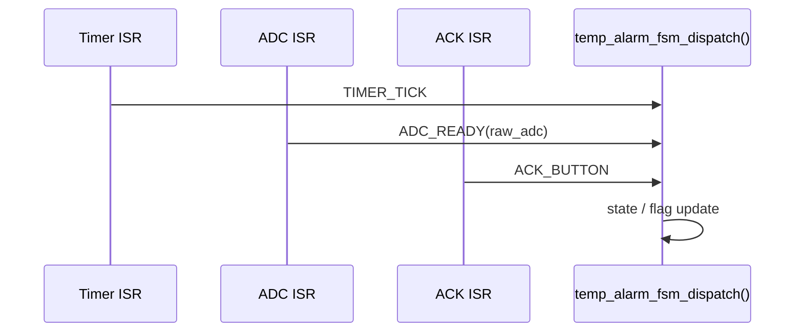

# ISRの具体例

温度アラームを題材に、ISRを短く保ちつつ状態機械へイベントを渡す具体例です。ポイントは、割り込みハンドラでは重い処理をせず、イベント通知だけを行うことです。

## ねらい

- ISRで何をやるべきかを具体例で説明できるようにする
- タイマ、ADC完了、ボタン割り込みの役割を分離する
- ISR由来のイベントもホスト環境でテストできるようにする

## ISRごとの役割

| ISR | やること | 発行イベント |
|-----|----------|--------------|
| タイマ割り込み | 次のサンプリング要求を上げる | TIMER_TICK |
| ADC完了割り込み | 取得済みADC値を状態機械へ渡す | ADC_READY |
| ACKボタン割り込み | ユーザ確認入力を通知する | ACK_BUTTON |

## 割り込みから状態機械への流れ



## ISRの実装例

```c
void temp_alarm_fsm_on_timer_interrupt(temp_alarm_fsm_t *fsm) {
    const temp_alarm_event_t event = { TEMP_ALARM_EVENT_TIMER_TICK, 0 };
    temp_alarm_fsm_dispatch(fsm, &event);
}

void temp_alarm_fsm_on_adc_interrupt(temp_alarm_fsm_t *fsm, uint16_t raw_adc) {
    const temp_alarm_event_t event = { TEMP_ALARM_EVENT_ADC_READY, raw_adc };
    temp_alarm_fsm_dispatch(fsm, &event);
}

void temp_alarm_fsm_on_ack_interrupt(temp_alarm_fsm_t *fsm) {
    const temp_alarm_event_t event = { TEMP_ALARM_EVENT_ACK_BUTTON, 0 };
    temp_alarm_fsm_dispatch(fsm, &event);
}
```

## ISRで避けること

- 長いループや待ち処理
- 複雑な分岐や複数責務の混在
- ログ整形や重い文字列処理
- 多数のモジュールへの直接書き込み

ISRが肥大化すると、割り込み遅延とテスト困難が同時に悪化します。イベントだけ渡して通常関数へ逃がす方が、安全で検証しやすい構造になります。

## テストコード例

```cpp
TEST_F(TempAlarmFsmTest, TimerInterruptRequestsSampleWithoutChangingState) {
    startMonitoring();
    fsm.sample_requested = 0;

    temp_alarm_fsm_on_timer_interrupt(&fsm);

    EXPECT_EQ(TEMP_ALARM_STATE_MONITORING, fsm.state);
    EXPECT_EQ(1, fsm.sample_requested);
}

TEST_F(TempAlarmFsmTest, AckInterruptReturnsFromAlarmToMonitoring) {
    startMonitoring();
    temp_alarm_fsm_on_adc_interrupt(&fsm, 4000);

    temp_alarm_fsm_on_ack_interrupt(&fsm);

    EXPECT_EQ(TEMP_ALARM_STATE_MONITORING, fsm.state);
    EXPECT_EQ(0, fsm.alarm_led_on);
}
```

## 読み方のポイント

1. temp_alarm_fsm_on_timer_interrupt で周期イベントの上げ方を見る
2. temp_alarm_fsm_on_adc_interrupt でデータ付きイベントの渡し方を見る
3. test_event_fsm.cpp で、ISR起点でもホストテストできることを確認する