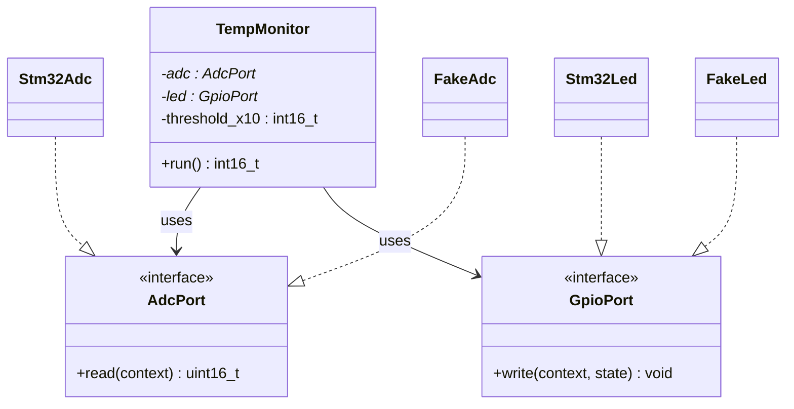
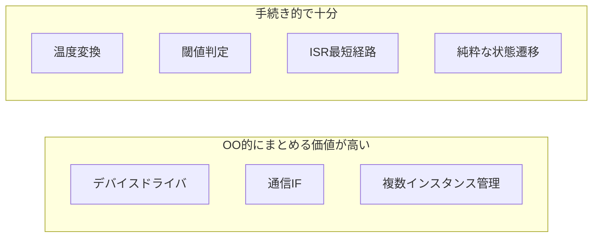

# 第13章: 組み込みCでオブジェクト指向をどう扱うか

組み込み C で「オブジェクト指向を採用する」と言っても、C++ のクラス継承をそのまま持ち込む話ではありません。C で現実的に取り入れるのは、主に **責務のカプセル化**、**抽象インターフェース**、**差し替え可能性** の 3 点です。

この章では、どこにオブジェクト指向の考え方が効くのか、逆にどこでは手続き的な設計のままでよいのかを、UML 風の図と C の具体例で整理します。

## 13.1 結論

> **結論**: 組み込み C では、ハードウェア差分・状態を持つ複数インスタンス・差し替えが必要な境界にはオブジェクト指向の考え方が有効です。一方で、純粋な計算、単純な制御、ISR の最短経路には、無理にオブジェクト指向を入れない方が読みやすく高速です。

## 13.2 メリット / デメリット

| 観点 | メリット | デメリット |
|------|----------|-----------|
| 保守性 | 責務ごとに分離しやすい | 構造体、関数ポインタ、初期化コードが増える |
| 移植性 | STM32 / nRF / ホストテストで実装差し替えしやすい | 抽象化が過剰だと「何を呼んでいるか」が見えにくい |
| テスト容易性 | フェイク実装を差し込める | 初学者には追跡コストが上がる |
| 再利用性 | 同じ API で複数デバイスを扱える | RAM/ROM と間接呼び出しコストが増えることがある |
| 設計品質 | 依存方向を整理しやすい | 小さな機能ではオーバーエンジニアリングになりやすい |

## 13.3 オブジェクト指向を入れるべきところ

### 1) ハードウェア差分を隠したい境界

- ADC, GPIO, UART, SPI, I2C, CAN
- 実機実装とホストテスト用フェイクを差し替えたい箇所
- ベンダ依存 API をアプリ層から隔離したい箇所

### 2) 複数インスタンスを同じ操作で扱いたい箇所

- センサ A / センサ B
- 複数 UART ポート
- 複数チャネルのドライバ

### 3) 状態と操作をペアで閉じ込めたい箇所

- 通信ドライバ
- デバイスハンドル
- プロトコルスタックのセッション管理

## 13.4 オブジェクト指向が不要なところ

### 1) 純粋計算

- `temperature_convert()`
- `temperature_is_over()`
- CRC 計算、単位変換、閾値判定

### 2) 単純な状態遷移の中核ロジック

- `temp_alarm_transition()` のように「入力 → 次状態」を返す純粋関数
- 状態をデータ構造として扱う方が見通しがよい処理

### 3) ISR の最短経路

- 割り込み入口でのフラグ更新
- レイテンシを極小化したい箇所
- 間接呼び出しを避けたいホットパス

## 13.5 UML 風アーキテクチャ

### どこをオブジェクト指向風にまとめるか



この図のポイントは、**上位は抽象ポートに依存し、下位の具体実装を知らない** ことです。これは本教材の `HAL` や `ポートアダプタ` と同じ方向性で、C でのオブジェクト指向的な設計と考えられます。

### 逆に手続き的なままでよい領域



## 13.6 C での具体例: オブジェクト指向が有効な例

以下は、C で「インターフェース + 実体」を表す典型例です。`TempMonitor` が `ADC` と `LED` を直接知るのではなく、抽象ポートを通して使います。

```c
typedef struct {
    uint16_t (*read)(void *context);
    void *context;
} adc_port_t;

typedef struct {
    void (*write)(void *context, uint8_t state);
    void *context;
} gpio_port_t;

typedef struct {
    adc_port_t *adc;
    gpio_port_t *led;
    int16_t threshold_x10;
} temp_monitor_t;

int16_t temp_monitor_run(temp_monitor_t *self) {
    uint16_t raw = self->adc->read(self->adc->context);

    if (!temperature_is_valid(raw)) {
        self->led->write(self->led->context, 1);
        return -9999;
    }

    int16_t temp_x10 = temperature_convert(raw);
    self->led->write(self->led->context,
                     (uint8_t)temperature_is_over(temp_x10, self->threshold_x10));
    return temp_x10;
}
```

この形が向いているのは、次のような場面です。

- STM32 実装、nRF 実装、テスト用フェイクを差し替えたい
- 同じ監視ロジックを複数センサで使い回したい
- モジュールごとに状態と依存先をまとめたい

## 13.7 C での具体例: オブジェクト指向が不要な例

本教材の `src/app/temperature.c` は、あえてオブジェクト化しない方が分かりやすい例です。

```c
int16_t temperature_convert(uint16_t raw_adc) {
    int32_t mv = (int32_t)raw_adc * 3300 / 4095;
    return (int16_t)(mv / 10);
}

int temperature_is_over(int16_t temp_x10, int16_t threshold_x10) {
    return (temp_x10 > threshold_x10) ? 1 : 0;
}
```

このコードに `temperature_object_t` や `temperature_ops_t` を持ち込んでも、

- 状態を持っていない
- 差し替え先がない
- 単純な入力→出力変換で完結している

ため、複雑になるだけです。

同様に、`src/app/temp_alarm_fsm.c` の中核である `temp_alarm_transition()` も、次状態を返す純粋関数として読めることが重要です。ここに無理に「状態オブジェクトの仮想メソッド」を導入すると、遷移表の見通しとテスト容易性が落ちやすくなります。

## 13.8 本リポジトリとの対応

| 観点 | 本リポジトリでの位置づけ |
|------|-------------------------|
| OO 的な考え方が効く境界 | `src/hal/hal_adc.h`, `src/hal/hal_gpio.h`, `src/autosar/*` |
| 手続き的なままがよいロジック | `src/app/temperature.c` |
| データ中心で扱う方が明快な設計 | `src/app/temp_alarm_fsm.c` |
| 悪い例との比較対象 | `src/before/bad_temp.c` |

つまり本教材は、**「全面的にオブジェクト指向化する」のではなく、「境界だけを抽象化し、中核ロジックはシンプルな C のまま保つ」** という現実的な折衷案を採っています。

## 13.9 採用判断のチェックリスト

次の 4 つのうち 2 つ以上に当てはまるなら、オブジェクト指向の考え方を入れる価値があります。

- 実装差し替えがある
- 複数インスタンスを扱う
- 状態と操作を一体で管理したい
- テストでフェイク差し込みしたい

逆に、次の条件なら手続き的設計で十分です。

- 純粋関数で書ける
- 1 回限りの単純処理である
- ISR など性能優先である
- 抽象化よりも追跡容易性が重要である

## 13.10 まとめ

- 組み込み C で有効なのは、**継承中心の OOP** ではなく **抽象化とカプセル化**  
- HAL、ドライバ、通信境界、複数インスタンス管理では有効  
- 温度変換、閾値判定、純粋状態遷移、ISR 最短経路では不要なことが多い  
- 本教材の設計方針は、**境界は OO 的、中核ロジックは手続き的** である
