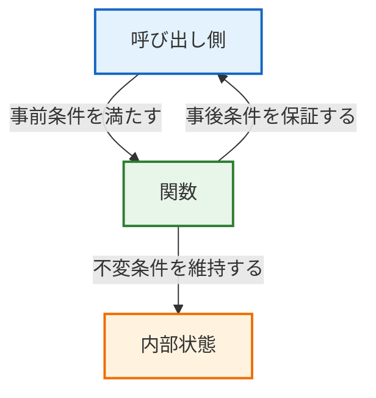
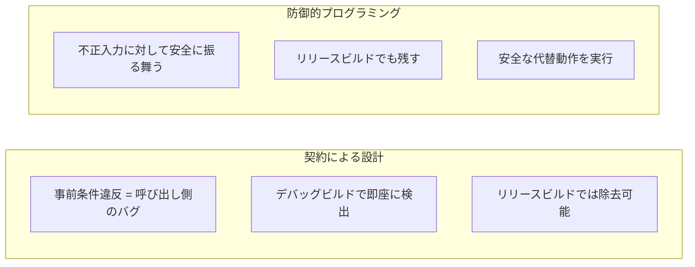

# 第14章: 契約による設計（Design by Contract）

## 14.1 契約による設計とは

「契約による設計」(Design by Contract, DbC) は Bertrand Meyer が提唱した設計手法で、関数やモジュールの **呼び出し側** と **提供側** の間に「契約」を定義します。



### 契約の3要素

| 種別 | 英語 | 責任者 | 意味 |
|------|------|--------|------|
| 事前条件 | Precondition | 呼び出し側 | 関数を呼ぶ前に満たすべき条件 |
| 事後条件 | Postcondition | 提供側 | 関数が返る時に保証する条件 |
| 不変条件 | Invariant | 提供側 | 操作の前後で常に成り立つ条件 |

## 14.2 組み込みCでのDbC実装パターン

### アサーションマクロの定義

```c
/* dbc_assert.h */
#ifndef NDEBUG
#define DBC_REQUIRE(expr) \
    do { if (!(expr)) dbc_violation_handler("PRE", #expr, __FILE__, __LINE__); } while(0)
#define DBC_ENSURE(expr) \
    do { if (!(expr)) dbc_violation_handler("POST", #expr, __FILE__, __LINE__); } while(0)
#define DBC_INVARIANT(expr) \
    do { if (!(expr)) dbc_violation_handler("INV", #expr, __FILE__, __LINE__); } while(0)
#else
#define DBC_REQUIRE(expr)   ((void)0)
#define DBC_ENSURE(expr)    ((void)0)
#define DBC_INVARIANT(expr) ((void)0)
#endif
```

### ポイント

- `NDEBUG` 定義時（リリースビルド）はゼロコスト
- 違反ハンドラは弱シンボルで差し替え可能
- テスト環境では違反を記録して検査、実機ではフェイルセーフ処理

## 14.3 具体例: バッテリ監視モジュール

### ヘッダファイルに契約を文書化する

```c
/**
 * @brief ADC 生値を電圧 [mV] に変換する（純粋関数）
 * @param raw_adc ADC 生値（12bit, 0〜4095）
 * @return 電圧値 [mV]（0〜3300）
 *
 * 事前条件: raw_adc <= 4095
 * 事後条件: 戻り値 <= 3300
 */
uint16_t battery_raw_to_mv(uint16_t raw_adc);
```

### 実装に契約を埋め込む

```c
uint16_t battery_raw_to_mv(uint16_t raw_adc)
{
    /* 事前条件 */
    DBC_REQUIRE(raw_adc <= ADC_MAX);

    if (raw_adc > ADC_MAX) {
        return VREF_MV; /* 防御的プログラミング */
    }

    uint16_t voltage_mv = (uint16_t)((uint32_t)raw_adc * VREF_MV / ADC_MAX);

    /* 事後条件 */
    DBC_ENSURE(voltage_mv <= VREF_MV);

    return voltage_mv;
}
```

## 14.4 DbC と防御的プログラミングの使い分け



### 組み合わせのベストプラクティス

| 場面 | DbC (REQUIRE/ENSURE) | 防御的処理 (if + return) |
|------|---------------------|--------------------------|
| 内部モジュール間の呼び出し | ✅ バグの早期検出 | △ 必要に応じて |
| 外部入力（センサ値等） | △ 参考情報として | ✅ 必須 |
| 安全関連の処理 | ✅ 開発時検出 | ✅ リリースでも安全に |

## 14.5 テストでの契約検証

契約違反をテストから意図的に引き起こし、検出できることを確認します。

```cpp
TEST(BatteryMonitorInit, PreconditionViolation_CriticalNotLessThanLow) {
    battery_monitor_t ctx;
    dbc_reset_violations();
    // critical(2800) >= low(2700) → 事前条件違反
    battery_monitor_init(&ctx, 2700, 2800, 3100);
    EXPECT_GT(dbc_get_violation_count(), 0);
    EXPECT_STREQ("PRE", dbc_get_last_violation_type());
}
```

## 14.6 まとめ

> **結論**: 組み込み C での DbC は、ヘッダの Doxygen コメントに契約を文書化し、`DBC_REQUIRE` / `DBC_ENSURE` / `DBC_INVARIANT` マクロで実装に埋め込む。開発時はバグの早期検出に、テスト時は仕様の網羅的検証に活用する。

**サンプルコード:**
- `src/dbc/dbc_assert.h` … 契約マクロ定義
- `src/dbc/dbc_assert.c` … 違反ハンドラ（差し替え可能）
- `src/dbc/battery_monitor.h` … 契約付きヘッダ
- `src/dbc/battery_monitor.c` … 契約付き実装
- `Test/test_dbc_tdd.cpp` … 契約違反テスト含む検証コード
