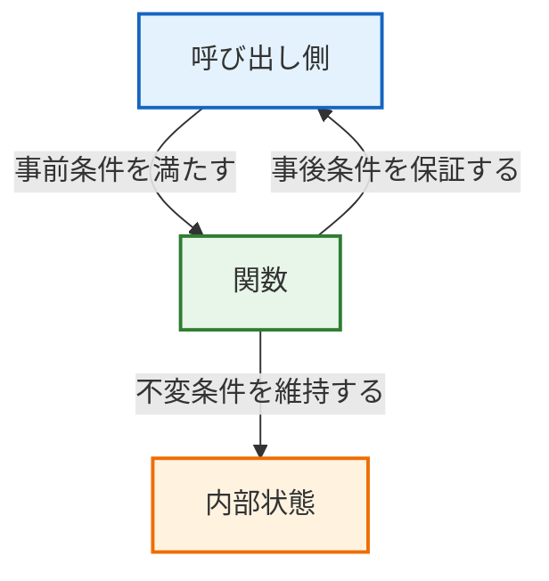
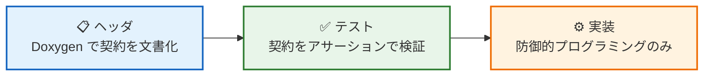
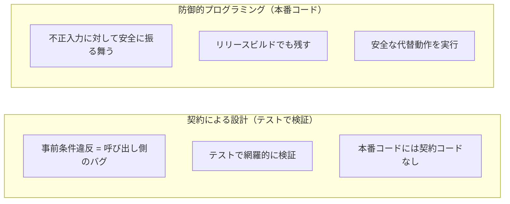

# 第14章: 契約による設計（Design by Contract）

## 14.1 契約による設計とは

「契約による設計」(Design by Contract, DbC) は Bertrand Meyer が提唱した設計手法で、関数やモジュールの **呼び出し側** と **提供側** の間に「契約」を定義します。



### 契約の3要素

| 種別 | 英語 | 責任者 | 意味 |
|------|------|--------|------|
| 事前条件 | Precondition | 呼び出し側 | 関数を呼ぶ前に満たすべき条件 |
| 事後条件 | Postcondition | 提供側 | 関数が返る時に保証する条件 |
| 不変条件 | Invariant | 提供側 | 操作の前後で常に成り立つ条件 |

## 14.2 実践的なDbC: テストコードで契約を守る

### なぜ本番コードにマクロを入れないのか

従来の DbC 実装では `DBC_REQUIRE` / `DBC_ENSURE` / `DBC_INVARIANT` マクロを本番コードに埋め込む方法が紹介されますが、実際の組み込み開発現場では以下の理由で採用しにくい場合があります:

| 課題 | 説明 |
|------|------|
| コードサイズ制約 | マクロ展開によるROM消費が許容できない場合がある |
| 既存コードとの整合性 | チーム内で統一されていないと混乱を招く |
| レビュー負荷 | ビジネスロジックと契約検証コードが混在し可読性が下がる |
| NDEBUG の管理 | ビルド構成の切り替え忘れによるリスク |

### 本教材のアプローチ: テストが契約の番人になる



1. **ヘッダファイル**: Doxygen コメントに契約（事前条件・事後条件・不変条件）を記述
2. **テストコード**: 契約を GoogleTest のアサーションで検証
3. **本番コード**: 防御的プログラミング（`if` + 安全な代替動作）のみ

## 14.3 具体例: バッテリ監視モジュール

### ヘッダファイルに契約を文書化する

```c
/**
 * @brief ADC 生値を電圧 [mV] に変換する（純粋関数）
 * @param raw_adc ADC 生値（12bit, 0〜4095）
 * @return 電圧値 [mV]（0〜3300）
 *
 * 事前条件: raw_adc <= 4095
 * 事後条件: 戻り値 <= 3300
 */
uint16_t battery_raw_to_mv(uint16_t raw_adc);
```

### 本番コードは防御的プログラミングのみ

```c
uint16_t battery_raw_to_mv(uint16_t raw_adc)
{
    /* 防御的処理: 範囲外は最大電圧として返す */
    if (raw_adc > ADC_MAX) {
        return VREF_MV;
    }

    uint16_t voltage_mv = (uint16_t)((uint32_t)raw_adc * VREF_MV / ADC_MAX);

    return voltage_mv;
}
```

### テストコードで契約を検証する

```cpp
// 事前条件: raw_adc <= 4095 を満たす最小値・最大値
TEST(BatteryRawToMv, Precondition_ZeroIsValid) {
    EXPECT_EQ(0, battery_raw_to_mv(0));
}

TEST(BatteryRawToMv, Precondition_MaxIsValid) {
    EXPECT_EQ(3300, battery_raw_to_mv(4095));
}

// 事前条件違反時: 防御的に安全な値を返すことを確認
TEST(BatteryRawToMv, Precondition_OverMaxIsSafelyHandled) {
    uint16_t result = battery_raw_to_mv(4096);
    EXPECT_EQ(3300, result);
}

// 事後条件: 全ての有効入力で戻り値 <= 3300
TEST(BatteryRawToMv, Postcondition_VoltageInRange) {
    for (uint16_t adc = 0; adc <= 4095; adc += 100) {
        uint16_t mv = battery_raw_to_mv(adc);
        EXPECT_LE(mv, 3300) << "事後条件違反: adc=" << adc;
    }
}
```

## 14.4 DbC と防御的プログラミングの使い分け



### ベストプラクティス

| 場面 | テストでの契約検証 | 本番コードの防御的処理 |
|------|-------------------|----------------------|
| 内部モジュール間の呼び出し | ✅ テストで事前条件を検証 | △ 必要に応じて |
| 外部入力（センサ値等） | ✅ 境界値テストで検証 | ✅ 必須 |
| 安全関連の処理 | ✅ 全パスをテスト | ✅ リリースでも安全に |
| NULLポインタ | ✅ テストで動作確認 | ✅ 必須 |

## 14.5 テストでの契約検証パターン

### 事前条件の検証

テストで「正しい入力では正常動作すること」と「不正入力では安全に処理されること」を確認します。

```cpp
// 事前条件: critical_mv < low_mv を確認
TEST(BatteryMonitorContract, Precondition_InitRequiresCriticalLessThanLow) {
    battery_monitor_t ctx;
    battery_monitor_init(&ctx, 2700, 2400, 3100);  // critical < low < over
    EXPECT_EQ(BATTERY_STATE_NORMAL, ctx.last_state);
    EXPECT_EQ(2700, ctx.low_threshold_mv);
    EXPECT_EQ(2400, ctx.critical_threshold_mv);
}
```

### 事後条件の検証

テストで「関数の戻り値が常に契約を満たすこと」を確認します。

```cpp
// 事後条件: 有効な入力に対して INVALID を返さない
TEST_F(BatteryMonitorTest, Postcondition_EvaluateNeverReturnsInvalidForValidInput) {
    const uint16_t voltages[] = {0, 1000, 2400, 2700, 2800, 3100, 3200, 3300};
    for (auto mv : voltages) {
        battery_state_t state = battery_evaluate(&ctx_, mv);
        EXPECT_NE(BATTERY_STATE_INVALID, state)
            << "事後条件違反: voltage=" << mv;
    }
}
```

### 不変条件の検証

テストで「連続操作後も内部状態が一貫していること」を確認します。

```cpp
// 不変条件: どのADC値でも last_voltage_mv <= 3300
TEST_F(BatteryMonitorTest, Invariant_VoltageAlwaysInRange) {
    const uint16_t test_values[] = {0, 100, 1000, 2048, 3000, 4000, 4095};
    for (auto adc : test_values) {
        battery_monitor_update(&ctx_, adc);
        EXPECT_LE(ctx_.last_voltage_mv, 3300)
            << "不変条件違反: adc=" << adc;
    }
}
```

## 14.6 まとめ

> **結論**: 組み込み C での DbC は、ヘッダの Doxygen コメントに契約を文書化し、**テストコードで契約を検証する**。本番コードには防御的プログラミングのみを残し、契約マクロは埋め込まない。テストが契約の番人として機能することで、実践的かつ保守しやすい設計を実現する。

**サンプルコード:**
- `src/dbc/battery_monitor.h` … 契約を Doxygen で文書化したヘッダ
- `src/dbc/battery_monitor.c` … 防御的プログラミングによる実装
- `Test/test_dbc_tdd.cpp` … テストコードで契約を検証
