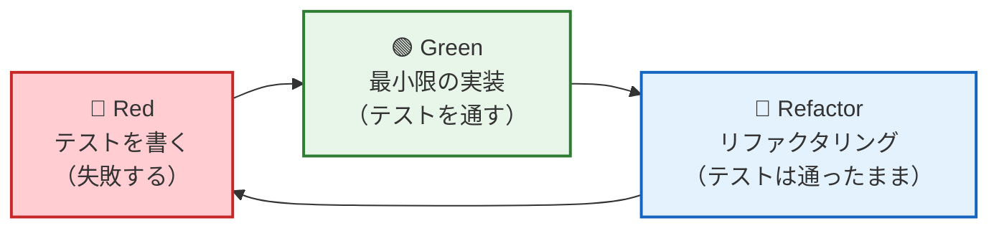
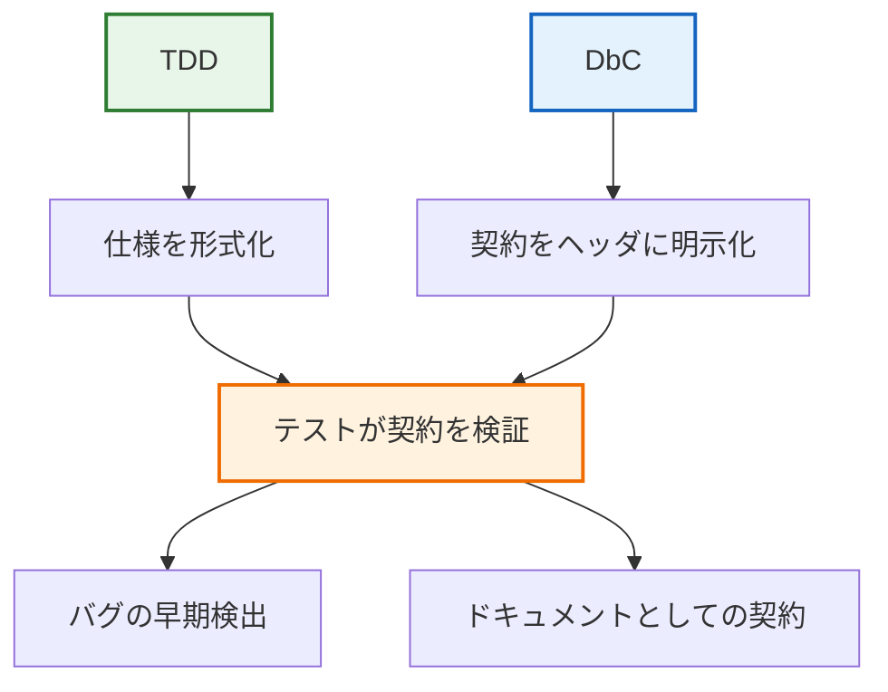

# 第15章: テスト駆動開発（TDD）実践

## 15.1 TDD の基本サイクル

第7章では AI 駆動開発と TDD の関係を説明しました。本章では、**人間が手を動かす TDD** の具体的な進め方を、バッテリ監視モジュールを題材に示します。



## 15.2 TDD の原則

1. **テストを先に書く** — 何を作るかを明確にしてから実装する
2. **最小限の実装** — テストを通すために必要最小限のコードだけ書く
3. **リファクタリング** — テストが通る状態を維持しながら設計を改善する

### 組み込みでの TDD が難しいと言われる理由と対策

| 困難 | 対策 |
|------|------|
| ハードウェアがないと動かない | ポートアダプタ + フェイク（第3章） |
| ビルド時間が長い | ホスト向けビルドで高速に回す |
| 状態が多い | 純粋関数化して状態を引数に |
| リアルタイム制約がある | ロジックと時間制約を分離 |

## 15.3 実践: バッテリ監視モジュールの TDD

### サイクル1: ADC → 電圧変換

#### 🔴 Red: テストを書く

```cpp
TEST(BatteryRawToMv, Precondition_ZeroIsValid) {
    EXPECT_EQ(0, battery_raw_to_mv(0));
}

TEST(BatteryRawToMv, Precondition_MaxIsValid) {
    EXPECT_EQ(3300, battery_raw_to_mv(4095));
}

TEST(BatteryRawToMv, MidpointInput) {
    uint16_t result = battery_raw_to_mv(2048);
    EXPECT_GE(result, 1649);
    EXPECT_LE(result, 1651);
}
```

この時点では `battery_raw_to_mv` は存在しないため、コンパイルエラーになる。

#### 🟢 Green: 最小限の実装

```c
uint16_t battery_raw_to_mv(uint16_t raw_adc)
{
    return (uint16_t)((uint32_t)raw_adc * 3300 / 4095);
}
```

テストが通ることを確認:
```bash
cmake --build build && ctest --test-dir build --output-on-failure -R BatteryRawToMv
```

#### 🔵 Refactor: 防御的処理と事後条件テストの追加

```c
uint16_t battery_raw_to_mv(uint16_t raw_adc)
{
    /* 防御的処理: 範囲外は最大電圧として返す */
    if (raw_adc > ADC_MAX) { return VREF_MV; }

    uint16_t voltage_mv = (uint16_t)((uint32_t)raw_adc * VREF_MV / ADC_MAX);

    return voltage_mv;
}
```

事後条件をテストで検証:
```cpp
TEST(BatteryRawToMv, Postcondition_VoltageInRange) {
    for (uint16_t adc = 0; adc <= 4095; adc += 100) {
        uint16_t mv = battery_raw_to_mv(adc);
        EXPECT_LE(mv, 3300) << "事後条件違反: adc=" << adc;
    }
}
```

### サイクル2: 電圧 → 状態判定

#### 🔴 Red: 各状態の判定テスト

```cpp
TEST_F(BatteryMonitorTest, NormalVoltage) {
    EXPECT_EQ(BATTERY_STATE_NORMAL, battery_evaluate(&ctx_, 2800));
}

TEST_F(BatteryMonitorTest, LowVoltage) {
    EXPECT_EQ(BATTERY_STATE_LOW, battery_evaluate(&ctx_, 2600));
}

TEST_F(BatteryMonitorTest, CriticalVoltage) {
    EXPECT_EQ(BATTERY_STATE_CRITICAL, battery_evaluate(&ctx_, 2400));
}

TEST_F(BatteryMonitorTest, Overvoltage) {
    EXPECT_EQ(BATTERY_STATE_OVERVOLTAGE, battery_evaluate(&ctx_, 3200));
}
```

#### 🟢 Green: 閾値比較の実装

```c
battery_state_t battery_evaluate(const battery_monitor_t *ctx, uint16_t voltage_mv)
{
    if (voltage_mv > ctx->over_threshold_mv) return BATTERY_STATE_OVERVOLTAGE;
    if (voltage_mv <= ctx->critical_threshold_mv) return BATTERY_STATE_CRITICAL;
    if (voltage_mv <= ctx->low_threshold_mv) return BATTERY_STATE_LOW;
    return BATTERY_STATE_NORMAL;
}
```

#### 🔵 Refactor: 境界値テストの追加

```cpp
TEST_F(BatteryMonitorTest, BoundaryAtLowThreshold) {
    EXPECT_EQ(BATTERY_STATE_LOW, battery_evaluate(&ctx_, 2700));
}
TEST_F(BatteryMonitorTest, BoundaryAboveLowThreshold) {
    EXPECT_EQ(BATTERY_STATE_NORMAL, battery_evaluate(&ctx_, 2701));
}
```

### サイクル3: オーケストレータの統合

#### 🔴 Red: ADC 生値から状態更新までの一気通貫テスト

```cpp
TEST_F(BatteryMonitorTest, UpdateFromAdc_Normal) {
    battery_state_t state = battery_monitor_update(&ctx_, 3500);
    EXPECT_EQ(BATTERY_STATE_NORMAL, state);
    EXPECT_EQ(state, ctx_.last_state);
    EXPECT_LE(ctx_.last_voltage_mv, 3300);
}
```

#### 🟢 Green: 既存の純粋関数を組み合わせる

```c
battery_state_t battery_monitor_update(battery_monitor_t *ctx, uint16_t raw_adc)
{
    /* 防御的処理: NULLポインタ */
    if (ctx == 0) { return BATTERY_STATE_INVALID; }

    uint16_t voltage_mv = battery_raw_to_mv(raw_adc);
    battery_state_t state = battery_evaluate(ctx, voltage_mv);
    ctx->last_voltage_mv = voltage_mv;
    ctx->last_state = state;
    return state;
}
```

## 15.4 TDD と DbC の相乗効果



| 組み合わせ | 効果 |
|-----------|------|
| ヘッダに事前条件を定義 → テストで境界値を検証 | 呼び出し側のバグを早期発見 |
| ヘッダに事後条件を定義 → テストで全パスを検証 | 実装のバグを早期発見 |
| ヘッダに不変条件を定義 → テストで連続操作を検証 | 状態管理のバグを早期発見 |

## 15.5 まとめ

> **結論**: TDD は「テストを先に書く」だけでなく、「何を作るかを明確にする設計活動」である。組み込み C では純粋関数化とポートアダプタを組み合わせることで、ホスト上で高速に Red-Green-Refactor を回せる。

**サンプルコード:**
- `Test/test_dbc_tdd.cpp` … TDD の各サイクルに対応するテスト
- `src/dbc/battery_monitor.c` … テスト駆動で育てた実装
