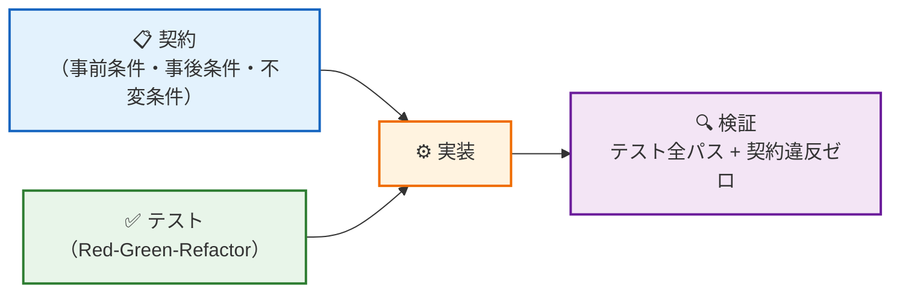
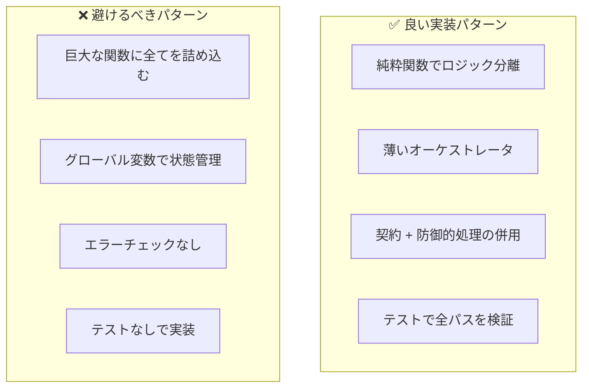
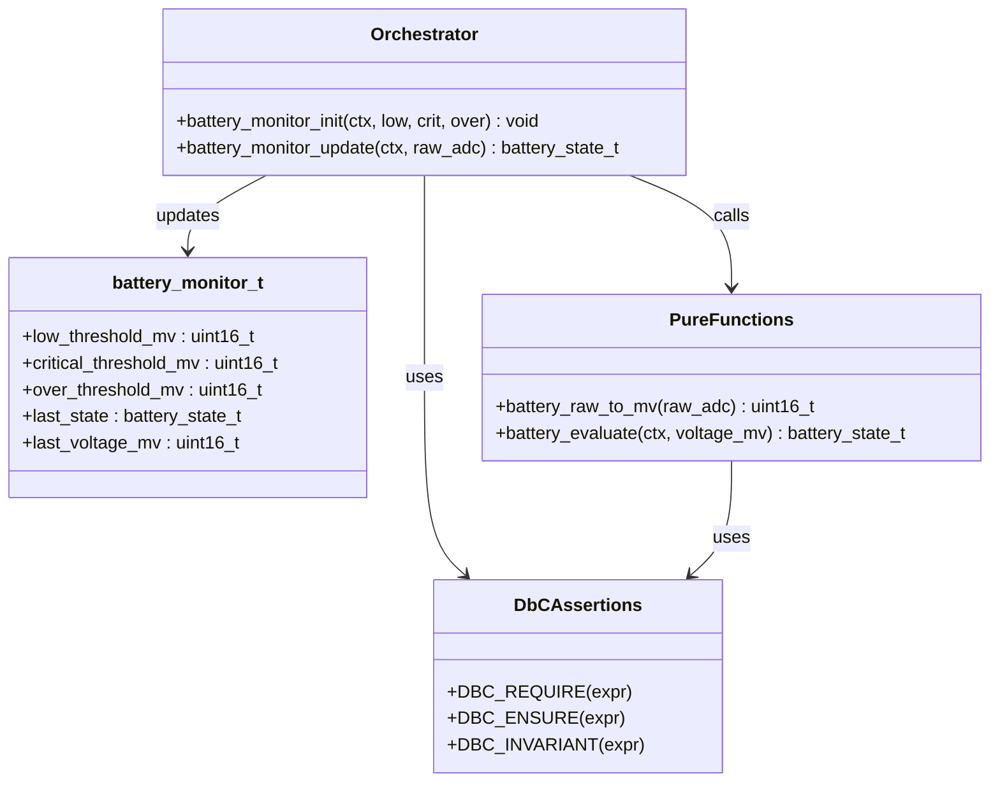

# 第16章: 実装 — 契約とテストに導かれる実装

## 16.1 実装フェーズの位置づけ

前章までで「何を作るか」は契約（第14章）とテスト（第15章）で明確になっています。本章では、契約とテストに導かれながら **安全で保守しやすい実装** を書く方法を示します。



## 16.2 実装の指針

### 1) 純粋関数を最大限に活用する

```c
/* ✅ 純粋関数: テストが容易、並行動作も安全 */
uint16_t battery_raw_to_mv(uint16_t raw_adc)
{
    return (uint16_t)((uint32_t)raw_adc * VREF_MV / ADC_MAX);
}
```

### 2) オーケストレータは薄く保つ

```c
/* ✅ オーケストレータ: 純粋関数を組み合わせるだけ */
battery_state_t battery_monitor_update(battery_monitor_t *ctx, uint16_t raw_adc)
{
    uint16_t voltage_mv = battery_raw_to_mv(raw_adc);
    battery_state_t state = battery_evaluate(ctx, voltage_mv);
    ctx->last_voltage_mv = voltage_mv;
    ctx->last_state = state;
    return state;
}
```

### 3) 契約アサーションを実装に埋め込む

```c
battery_state_t battery_monitor_update(battery_monitor_t *ctx, uint16_t raw_adc)
{
    /* 事前条件 */
    DBC_REQUIRE(ctx != 0);
    DBC_REQUIRE(raw_adc <= ADC_MAX);

    /* 防御的処理（契約違反時の安全な振る舞い） */
    if (ctx == 0) { return BATTERY_STATE_INVALID; }

    uint16_t voltage_mv = battery_raw_to_mv(raw_adc);
    battery_state_t state = battery_evaluate(ctx, voltage_mv);
    ctx->last_voltage_mv = voltage_mv;
    ctx->last_state = state;

    /* 事後条件 */
    DBC_ENSURE(ctx->last_state == state);
    /* 不変条件 */
    DBC_INVARIANT(ctx->last_voltage_mv <= VREF_MV);

    return state;
}
```

## 16.3 実装パターンの比較



## 16.4 バッテリ監視モジュールの全体構造



## 16.5 テスト結果による実装の検証

テスト駆動で書いた実装が正しいことを、以下のコマンドで確認します:

```bash
cmake --preset default
cmake --build build
ctest --test-dir build --output-on-failure -R "Battery|Dbc"
```

### テストカバレッジの確認ポイント

| テスト種別 | 確認内容 | 対応テスト |
|-----------|---------|-----------|
| 正常系 | 各状態の判定が正しいか | `NormalVoltage`, `LowVoltage`, `CriticalVoltage`, `Overvoltage` |
| 境界値 | 閾値の境界で正しく判定されるか | `BoundaryAt*`, `BoundaryAbove*` |
| 異常系 | NULL ポインタ等で安全に振る舞うか | `EvaluateNullReturnsInvalid`, `UpdateNullReturnsInvalid` |
| 契約検証 | 事前条件違反を検出できるか | `PreconditionViolation_CriticalNotLessThanLow` |
| 不変条件 | 連続操作で範囲逸脱しないか | `InvariantVoltageRange` |

## 16.6 リリースビルドでの契約除去

```c
/* CMakeLists.txt でリリースビルド時に NDEBUG を定義 */
target_compile_definitions(DbcLibrary PRIVATE $<$<CONFIG:Release>:NDEBUG>)
```

- デバッグビルド: 契約アサーションが有効、違反時にハンドラ呼び出し
- リリースビルド: 契約アサーションがゼロコストで除去される
- 防御的処理 (`if` + `return`) はリリースでも残る

## 16.7 まとめ

> **結論**: 実装は「契約が定める what」と「テストが検証する how」に導かれて書く。純粋関数でロジックを分離し、薄いオーケストレータで組み合わせ、契約アサーションで開発時の安全網を張る。テストが通り、契約違反がゼロなら、実装は仕様を満たしている。

**サンプルコード:**
- `src/dbc/battery_monitor.c` … 契約付き実装の完成形
- `src/dbc/dbc_assert.h` … リリース時ゼロコストの契約マクロ
- `Test/test_dbc_tdd.cpp` … 実装の全パスを検証するテスト
